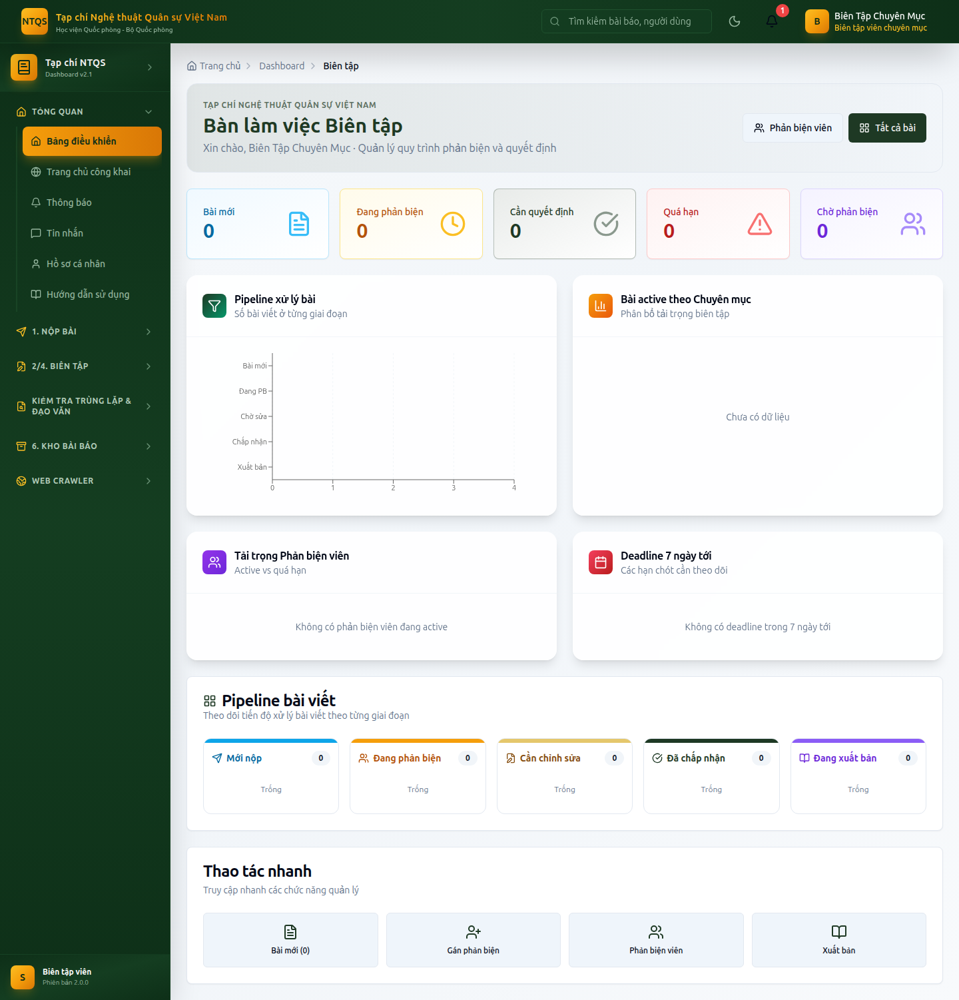

# HƯỚNG DẪN SỬ DỤNG — VAI TRÒ BIÊN TẬP VIÊN CHUYÊN MỤC
## Hệ thống Tạp chí điện tử — Tạp chí Nghệ thuật Quân sự Việt Nam (Học viện Quốc phòng)

> Tài liệu dành cho **Biên tập viên chuyên mục (SECTION_EDITOR)** — xử lý các bài **được phân công**:
> gán phản biện, theo dõi tiến độ, ra quyết định biên tập. Xem thêm: `docs/huong-dan/README.md`.

---

## MỤC LỤC
1. [Vai trò & phạm vi](#1-vai-trò--phạm-vi)
2. [Đăng nhập & bảng điều khiển](#2-đăng-nhập--bảng-điều-khiển)
3. [Bài cần xử lý (chỉ bài được giao)](#3-bài-cần-xử-lý-chỉ-bài-được-giao)
4. [Gán phản biện](#4-gán-phản-biện)
5. [Ra quyết định biên tập](#5-ra-quyết-định-biên-tập)
6. [Quy trình & Deadline](#6-quy-trình--deadline)
7. [Kiểm tra đạo văn & kho bài báo](#7-kiểm-tra-đạo-văn--kho-bài-báo)
8. [Những gì KHÔNG làm](#8-những-gì-không-làm)

---

## 1. Vai trò & phạm vi
- **Chỉ thấy và xử lý bài được Thư ký tòa soạn PHÂN CÔNG cho mình** (khác với các vai trò lãnh đạo thấy toàn bộ).
- Được: gán phản biện, ra quyết định (chấp nhận/sửa/từ chối) trên bài được giao, kiểm tra đạo văn.
- Không được: ký xuất bản, đưa vào sản xuất, phân công biên tập viên, quản trị hệ thống/CMS.

---

## 2. Đăng nhập & bảng điều khiển
Vào `/auth/login` (demo: `bientap@tapchintqsvn.edu.vn` / `TapChi@2025`) → **Bảng điều khiển Biên tập** (`/dashboard/editor`).

Dashboard hiển thị: KPI (bài mới, đang phản biện, cần quyết định, quá hạn, phản biện chờ), bảng Kanban theo giai đoạn, biểu đồ khối lượng phản biện viên, deadline sắp tới — **tất cả giới hạn trong các bài được giao cho bạn**.

---

## 3. Bài cần xử lý (chỉ bài được giao)
**Vào:** **2/4. Biên Tập → Bài cần xử lý** (`/dashboard/editor/submissions`).
- Danh sách theo tab/trạng thái, tìm theo tiêu đề/mã/tác giả.
- Mở chi tiết để xem bản thảo (PDF), phản biện, mốc thời gian.

---

## 4. Gán phản biện
**Vào:** **2/4. Biên Tập → Gán phản biện** (`/dashboard/editor/assign-reviewers`).
1. Chọn bài (trong phạm vi được giao).
2. Chọn **tối thiểu 2 phản biện viên** đủ điều kiện (hệ thống gợi ý theo lĩnh vực, tự loại tác giả).
3. Xác nhận → bài chuyển *Đang phản biện*, tạo deadline, gửi lời mời.

---

## 5. Ra quyết định biên tập
Trên trang chi tiết bài, khi **đủ phản biện đã nộp**, khối **Ra quyết định** xuất hiện:
- **Chấp nhận** → bài chuyển *Đã chấp nhận* (sau đó Thư ký tòa soạn/Phó TBT đưa vào sản xuất).
- **Yêu cầu chỉnh sửa (nhỏ/lớn)** → bài chuyển *Cần chỉnh sửa*; tạo deadline để tác giả nộp bản sửa.
- **Từ chối** → bài chuyển *Từ chối*.

Nhập **nhận xét/kết luận** gửi tác giả. Quyết định được ghi nhật ký kiểm toán và gửi thông báo tự động.

> Với bài còn *Mới*, bạn có thể **Gửi phản biện** hoặc **Từ chối sơ bộ**.

---

## 6. Quy trình & Deadline
**Vào:** **2/4. Biên Tập → Quy trình & Deadline** (`/dashboard/editor/workflow`) — theo dõi deadline phản biện/quyết định/nộp bản sửa của các bài được giao.

---

## 7. Kiểm tra đạo văn & kho bài báo
- **Kiểm tra Đạo văn** (`/dashboard/plagiarism`) và **Kiểm tra trùng lặp** (`/dashboard/repository/duplicate-check`).
- **6. Kho Bài Báo:** CSDL Báo chí, Bài báo lịch sử, Báo cáo công bố, Tìm kiếm Nâng cao (xem tham khảo; quản trị toàn bộ bài đã xuất bản thuộc cấp lãnh đạo).

---

## 8. Những gì KHÔNG làm
- ❌ **Ký xuất bản** (chỉ Tổng biên tập).
- ❌ **Đưa vào sản xuất / dàn trang** (Thư ký tòa soạn trở lên).
- ❌ **Phân công biên tập viên** cho bài khác (Thư ký tòa soạn trở lên).
- ❌ Xử lý bài **không được phân công** cho mình.
- ❌ Quản trị người dùng/CMS/hệ thống.

---

> **Tài khoản demo:** `bientap@tapchintqsvn.edu.vn` / `TapChi@2025`.
