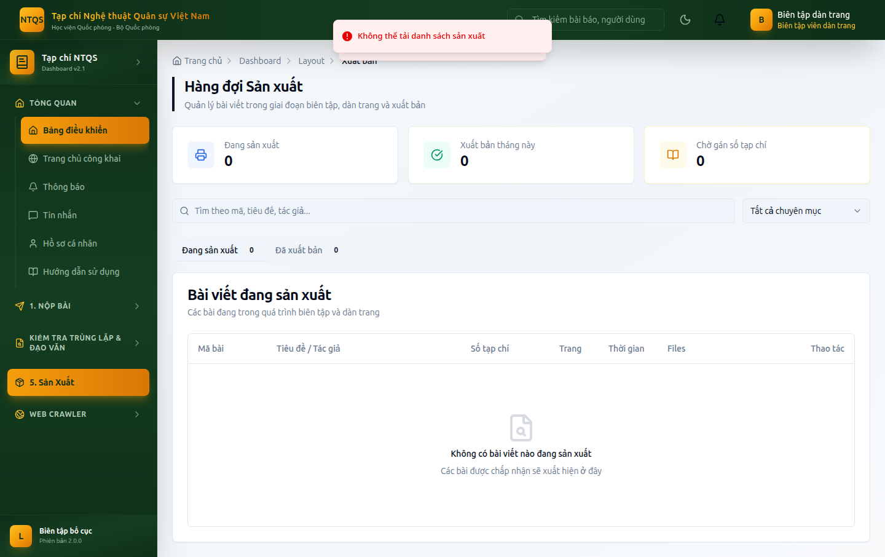

# HƯỚNG DẪN SỬ DỤNG — VAI TRÒ BIÊN TẬP VIÊN DÀN TRANG
## Hệ thống Tạp chí điện tử — Tạp chí Nghệ thuật Quân sự Việt Nam (Học viện Quốc phòng)

> Tài liệu dành cho **Biên tập viên dàn trang (LAYOUT_EDITOR)** — phụ trách khâu sản xuất:
> hiệu đính, dàn trang, hoàn thiện tệp xuất bản. Xem thêm: `docs/huong-dan/README.md`.

---

## MỤC LỤC
1. [Vai trò & phạm vi](#1-vai-trò--phạm-vi)
2. [Đăng nhập](#2-đăng-nhập)
3. [Hàng đợi Sản xuất](#3-hàng-đợi-sản-xuất)
4. [Hiệu đính & dàn trang](#4-hiệu-đính--dàn-trang)
5. [Hoàn thiện & trình xuất bản](#5-hoàn-thiện--trình-xuất-bản)
6. [Kiểm tra đạo văn/trùng lặp](#6-kiểm-tra-đạo-văntrùng-lặp)
7. [Những gì KHÔNG làm](#7-những-gì-không-làm)

---

## 1. Vai trò & phạm vi
Biên tập viên dàn trang nhận bài **đã được chấp nhận** và đưa vào giai đoạn **sản xuất**:
hiệu đính (copyediting), dàn trang, gắn metadata/DOI, chuẩn bị tệp xuất bản cuối. **Không ký xuất bản** (việc đó thuộc Tổng biên tập).

---

## 2. Đăng nhập
Vào `/auth/login` (demo: `dangtrang@tapchintqsvn.edu.vn` / `TapChi@2025`). Sau đăng nhập, hệ thống đưa thẳng vào **Hàng đợi Sản xuất** (`/dashboard/layout/production`).

---

## 3. Hàng đợi Sản xuất
**Vào:** **5. Sản Xuất → Hàng đợi Sản xuất** (`/dashboard/layout/production`).

Danh sách bài đang ở giai đoạn **Đang sản xuất (IN_PRODUCTION)** kèm chỉ số tiến độ. Mở từng bài để xử lý dàn trang.

---

## 4. Hiệu đính & dàn trang
Với mỗi bài trong hàng đợi:
1. Thực hiện **hiệu đính (copyediting)** — chỉnh chính tả, định dạng, thống nhất kiểu trình bày.
2. **Dàn trang** theo mẫu của Tạp chí; tải lên **tệp PDF bản cuối**.
3. Hoàn thiện **metadata** (tác giả, tóm tắt, từ khóa) và **DOI** nếu được phân quyền.

---

## 5. Hoàn thiện & trình xuất bản
- Khi bài đã dàn trang xong, **gán bài vào Số tạp chí** phù hợp (nếu được phân công).
- Đánh dấu hoàn tất → bài nằm trong danh sách **"Chờ ký xuất bản"** của Tổng biên tập.
- **Tổng biên tập** là người nhấn nút **Xuất bản** cuối cùng. Biên tập viên dàn trang **không** thấy nút này.

---

## 6. Kiểm tra đạo văn/trùng lặp
**Vào:** **Kiểm tra Trùng lặp & Đạo văn** → *Kiểm tra Đạo văn* (`/dashboard/plagiarism`), *Kiểm tra trùng lặp* (`/dashboard/repository/duplicate-check`) — đối chiếu trước khi hoàn thiện bản in.

---

## 7. Những gì KHÔNG làm
- ❌ **Ký xuất bản** (chỉ Tổng biên tập + Quản trị hệ thống).
- ❌ **Ra quyết định biên tập** (chấp nhận/từ chối) — thuộc biên tập viên/lãnh đạo.
- ❌ **Gán phản biện / phân công biên tập**.
- ❌ Quản trị người dùng/CMS/hệ thống.

---

> **Tài khoản demo:** `dangtrang@tapchintqsvn.edu.vn` / `TapChi@2025`.
