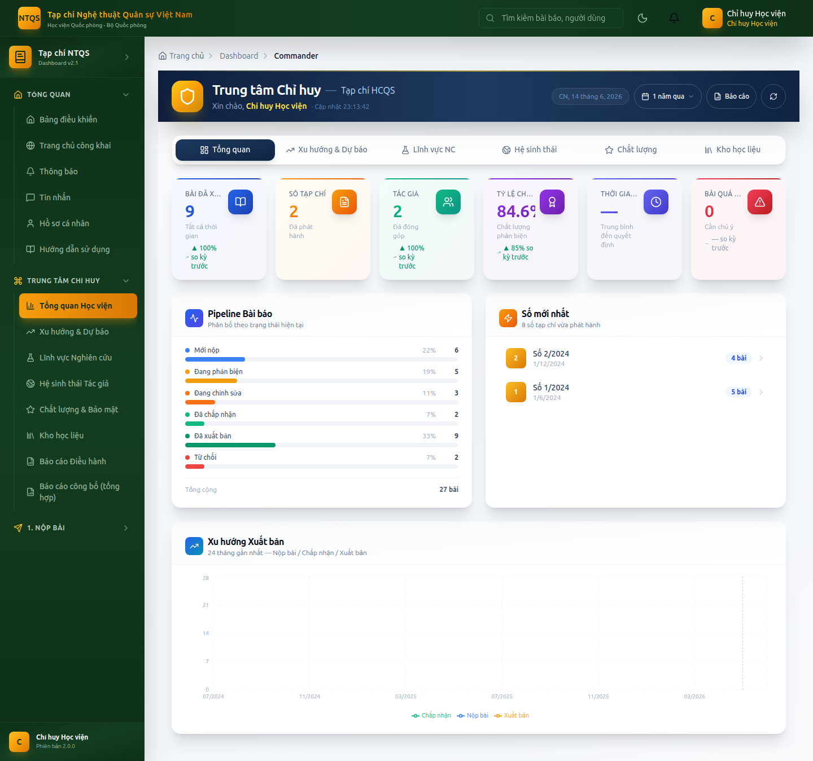

# HƯỚNG DẪN SỬ DỤNG — VAI TRÒ CHỈ HUY HỌC VIỆN
## Hệ thống Tạp chí điện tử — Tạp chí Nghệ thuật Quân sự Việt Nam (Học viện Quốc phòng)

> Tài liệu dành cho **Chỉ huy Học viện (COMMANDER)** — lãnh đạo Học viện **xem báo cáo tổng hợp**,
> giám sát toàn cảnh hoạt động Tạp chí. Vai trò **chỉ đọc**, không can thiệp nghiệp vụ biên tập.
> Xem thêm: `docs/huong-dan/README.md`.

---

## MỤC LỤC
1. [Vai trò & phạm vi](#1-vai-trò--phạm-vi)
2. [Đăng nhập](#2-đăng-nhập)
3. [Trung tâm Chỉ huy](#3-trung-tâm-chỉ-huy)
4. [Các nhóm báo cáo](#4-các-nhóm-báo-cáo)
5. [Báo cáo điều hành & công bố](#5-báo-cáo-điều-hành--công-bố)
6. [Những gì KHÔNG làm](#6-những-gì-không-làm)

---

## 1. Vai trò & phạm vi
Chỉ huy Học viện có góc nhìn **toàn cảnh, tổng hợp** về hoạt động của Tạp chí: số lượng & chất lượng bài,
xu hướng, lĩnh vực nghiên cứu, hệ sinh thái tác giả, an toàn — phục vụ chỉ đạo, đánh giá. **Không** tham gia
sàng lọc, phản biện, quyết định hay xuất bản.

---

## 2. Đăng nhập
Vào `/auth/login` (demo: `chihuy@tapchintqsvn.edu.vn` / `TapChi@2025`) → **Trung tâm Chỉ huy** (`/dashboard/commander`).

---

## 3. Trung tâm Chỉ huy
**Vào:** **Trung Tâm Chỉ Huy** trên menu. Trang tổng quan (`/dashboard/commander`) trình bày bức tranh toàn cảnh:
chỉ số chính của Tạp chí, tiến độ, cảnh báo nổi bật.

---

## 4. Các nhóm báo cáo
Menu **Trung Tâm Chỉ Huy** gồm các mục (mở theo tab):

| Mục | Đường dẫn | Nội dung |
|---|---|---|
| Tổng quan Học viện | `/dashboard/commander` | Bức tranh tổng thể |
| Xu hướng & Dự báo | `/dashboard/commander?tab=trend` | Diễn biến theo thời gian |
| Lĩnh vực Nghiên cứu | `/dashboard/commander?tab=research` | Phân bố theo lĩnh vực/chuyên mục |
| Hệ sinh thái Tác giả | `/dashboard/commander?tab=ecosystem` | Tác giả, tổ chức, hợp tác |
| Chất lượng & Bảo mật | `/dashboard/commander?tab=quality` | Chất lượng phản biện, an toàn |
| Kho học liệu | `/dashboard/commander?tab=library` | Tài nguyên/kho tri thức |

---

## 5. Báo cáo điều hành & công bố
- **Báo cáo Điều hành:** `/dashboard/commander/report` — báo cáo tổng hợp phục vụ lãnh đạo.
- **Báo cáo công bố (tổng hợp):** `/dashboard/reports/publications` — danh mục công bố toàn Tạp chí, xuất DOCX/XLSX/PDF.

---

## 6. Những gì KHÔNG làm
- ❌ Không sàng lọc/phản biện/ra quyết định biên tập.
- ❌ Không ký xuất bản, không dàn trang.
- ❌ Không quản trị người dùng/CMS/hệ thống.
- ✅ Chỉ **xem báo cáo & giám sát tổng hợp** để chỉ đạo.

---

> **Tài khoản demo:** `chihuy@tapchintqsvn.edu.vn` / `TapChi@2025`.
