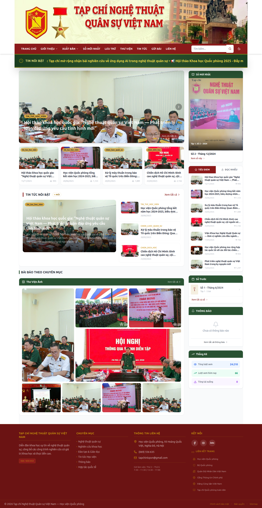
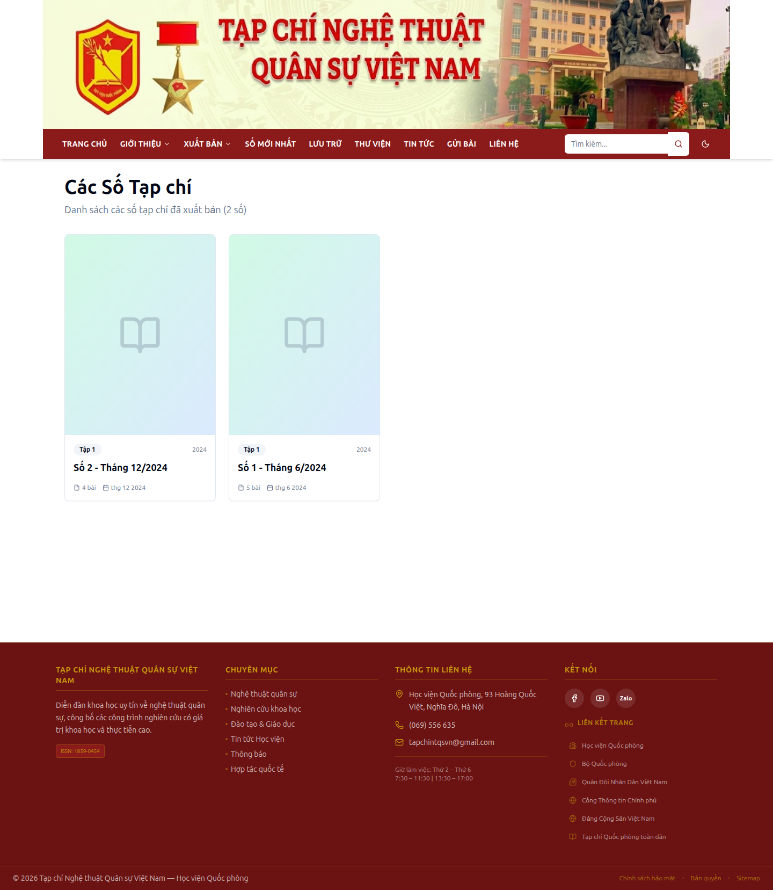
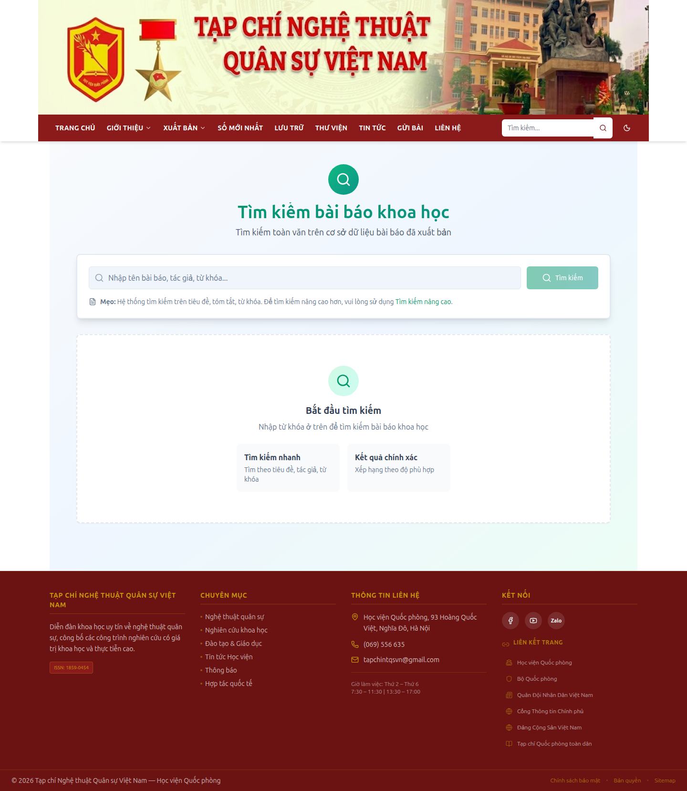

# HƯỚNG DẪN SỬ DỤNG — ĐỘC GIẢ (TRANG CÔNG KHAI)
## Hệ thống Tạp chí điện tử — Tạp chí Nghệ thuật Quân sự Việt Nam (Học viện Quốc phòng)

> Tài liệu dành cho **Độc giả (READER)** — người đọc nội dung công khai của Tạp chí.
> Độc giả **không cần đăng nhập** để đọc; không có bảng điều khiển riêng. Xem thêm: `docs/huong-dan/README.md`.

---

## MỤC LỤC
1. [Trang chủ Tạp chí](#1-trang-chủ-tạp-chí)
2. [Đọc các số tạp chí](#2-đọc-các-số-tạp-chí)
3. [Đọc & tải bài báo](#3-đọc--tải-bài-báo)
4. [Tìm kiếm bài](#4-tìm-kiếm-bài)
5. [Thư viện, Tin tức, Video, Podcast](#5-thư-viện-tin-tức-video-podcast)
6. [Thông tin & liên hệ tòa soạn](#6-thông-tin--liên-hệ-tòa-soạn)
7. [Đăng ký tài khoản (nếu muốn gửi bài)](#7-đăng-ký-tài-khoản-nếu-muốn-gửi-bài)

---

## 1. Trang chủ Tạp chí
**Vào:** trang chủ `/`.

Trang chủ giới thiệu: số mới nhất, bài nổi bật, chuyên mục, tin tức/thông báo và thanh điều hướng tới các khu vực đọc.

---

## 2. Đọc các số tạp chí
**Vào:** **Số tạp chí** (`/issues`) — danh sách các số đã xuất bản; **Số mới nhất** tại `/issues/latest`.

**Các bước:**
1. Mở `/issues` → chọn một số (theo tập/năm).
2. Trang chi tiết số (`/issues/[id]`) liệt kê **mục lục** các bài trong số.
3. Chọn **Đọc trực tuyến** để mở trình đọc (`/issues/[id]/viewer`) hoặc **Tải số** (`/issues/[id]/download`) nếu được phép.

---

## 3. Đọc & tải bài báo
**Vào:** **Bài báo** (`/articles`) hoặc nhấn vào một bài từ mục lục số.
- Trang chi tiết bài (`/articles/[id]`) hiển thị: tiêu đề, tác giả, tóm tắt, từ khóa, chuyên mục, DOI.
- Chọn **Tải PDF** để tải bản đầy đủ (nếu bài cho phép truy cập mở).

---

## 4. Tìm kiếm bài
**Vào:** **Tìm kiếm** (`/search`).

- Nhập **từ khóa** (tiêu đề, tác giả, nội dung) để tra cứu nhanh.
- **Tìm kiếm nâng cao** (`/search/advanced`): lọc theo chuyên mục, năm, tác giả, loại bài…

---

## 5. Thư viện, Tin tức, Video, Podcast
| Khu vực | Đường dẫn | Nội dung |
|---|---|---|
| Thư viện số (ebook) | `/library` | Đọc các bản số hóa/ấn phẩm |
| Lưu trữ | `/archive` | Kho số/bài cũ |
| Chuyên mục | `/categories` | Duyệt bài theo lĩnh vực |
| Tin tức | `/news` | Tin & thông báo của Tạp chí |
| Video | `/videos` | Tư liệu video |
| Podcast | `/podcasts` | Bản đọc audio |

---

## 6. Thông tin & liên hệ tòa soạn
- **Giới thiệu:** `/about` · **Liên hệ:** `/contact` · **Hướng dẫn cho tác giả:** `/guidelines` · **Quy trình xuất bản:** `/publishing-process` · **Giấy phép:** `/license`.
- Tòa soạn: Tạp chí Nghệ thuật Quân sự Việt Nam — Học viện Quốc phòng. ISSN 1859-0454.
  Địa chỉ: 93 Hoàng Quốc Việt, Nghĩa Đô, Hà Nội. Email: tapchintqsvn@gmail.com. ĐT: (069) 556 635.

---

## 7. Đăng ký tài khoản (nếu muốn gửi bài)
Độc giả chỉ cần đọc thì **không phải đăng nhập**. Nếu muốn **gửi bài** với tư cách Tác giả:
1. Vào `/auth/register` → đăng ký tài khoản (chọn vai trò Tác giả).
2. Chờ phê duyệt → đăng nhập tại `/auth/login`.
3. Xem hướng dẫn **Tác giả** (`tac-gia.md`) để nộp và theo dõi bài.

---

> Độc giả không có tài khoản demo riêng — truy cập trực tiếp trang công khai của Tạp chí.
