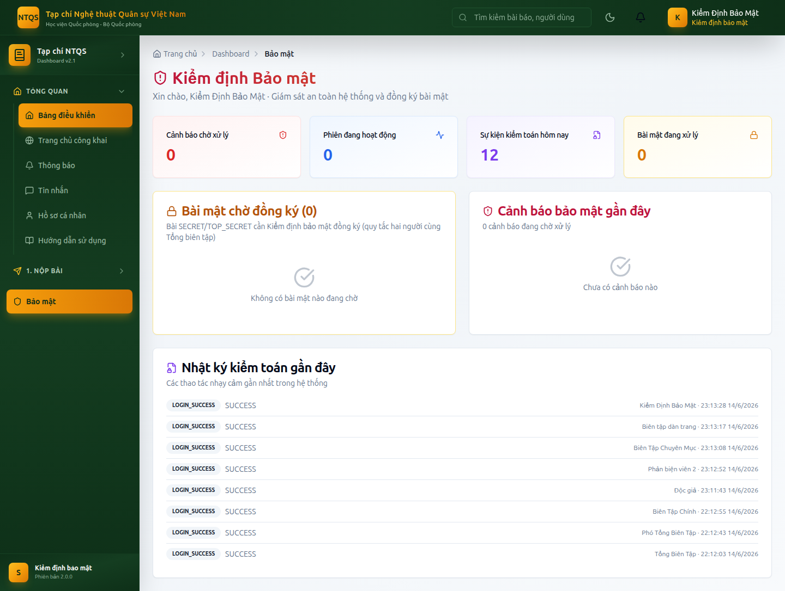

# HƯỚNG DẪN SỬ DỤNG — VAI TRÒ KIỂM ĐỊNH BẢO MẬT
## Hệ thống Tạp chí điện tử — Tạp chí Nghệ thuật Quân sự Việt Nam (Học viện Quốc phòng)

> Tài liệu dành cho **Kiểm định bảo mật (SECURITY_AUDITOR)** — giám sát an toàn hệ thống
> và **đồng ký bài mật** theo quy tắc hai người. Xem thêm: `docs/huong-dan/README.md`.

---

## MỤC LỤC
1. [Vai trò & phạm vi](#1-vai-trò--phạm-vi)
2. [Đăng nhập & Bảng kiểm soát bảo mật](#2-đăng-nhập--bảng-kiểm-soát-bảo-mật)
3. [Đồng ký bài mật (quy tắc hai người)](#3-đồng-ký-bài-mật-quy-tắc-hai-người)
4. [Cảnh báo bảo mật](#4-cảnh-báo-bảo-mật)
5. [Nhật ký kiểm toán & phiên đăng nhập](#5-nhật-ký-kiểm-toán--phiên-đăng-nhập)
6. [Những gì KHÔNG làm](#6-những-gì-không-làm)

---

## 1. Vai trò & phạm vi
Kiểm định bảo mật là lớp kiểm soát an toàn độc lập:
- Theo dõi **cảnh báo bảo mật**, **phiên đăng nhập**, **nhật ký kiểm toán**.
- **Đồng ký (co-sign)** các bài có độ mật **SECRET/TOP_SECRET** cùng Tổng biên tập trước khi chấp nhận.
- Không can thiệp nội dung biên tập thông thường.

---

## 2. Đăng nhập & Bảng kiểm soát bảo mật
Vào `/auth/login` (demo: `kiemtoan@tapchintqsvn.edu.vn` / `TapChi@2025`) → **Bảng kiểm soát bảo mật** (`/dashboard/security`).

Bảng điều khiển gồm:
- **4 thẻ KPI:** *Cảnh báo chờ xử lý*, *Phiên đang hoạt động*, *Sự kiện kiểm toán hôm nay*, *Bài mật đang xử lý*.
- **Bài mật chờ đồng ký:** danh sách bài SECRET/TOP_SECRET cần đồng ký.
- **Cảnh báo bảo mật gần đây:** theo mức độ (CRITICAL/HIGH/MEDIUM/LOW).
- **Nhật ký kiểm toán gần đây:** các thao tác nhạy cảm mới nhất.

---

## 3. Đồng ký bài mật (quy tắc hai người)
Với bài **SECRET/TOP_SECRET**, quyết định **Chấp nhận** chỉ hoàn tất khi có **đủ hai chữ ký: Tổng biên tập + Kiểm định bảo mật**.

**Các bước đồng ký:**
1. Trên bảng điều khiển, mở mục **Bài mật chờ đồng ký** → nhấn **Xem & đồng ký** ở bài cần xử lý.
2. Xem nội dung và bối cảnh phản biện.
3. Ghi quyết định **Chấp nhận** (đồng ký) kèm ý kiến.
4. Khi cả Tổng biên tập và Kiểm định bảo mật đều đã ký Chấp nhận, bài mới chuyển sang *Đã chấp nhận*; nếu thiếu một chữ ký, hệ thống hiển thị *"chờ người còn lại phê duyệt"*.

> Đây là cơ chế kiểm soát chặt nội dung quân sự/quốc phòng nhạy cảm đúng đặc thù Tạp chí.

---

## 4. Cảnh báo bảo mật
Theo dõi các cảnh báo (đăng nhập bất thường, truy cập trái phép…) ngay trên bảng điều khiển. Mỗi cảnh báo có **mức độ** và **trạng thái** (chờ xử lý/đã xem). Phối hợp Quản trị hệ thống để xử lý.

---

## 5. Nhật ký kiểm toán & phiên đăng nhập
- **Nhật ký kiểm toán:** danh sách thao tác nhạy cảm (ai làm, làm gì, lúc nào) — phục vụ truy vết: đăng nhập, quyết định biên tập, ký xuất bản, đổi quyền…
- **Phiên đăng nhập:** số phiên đang hoạt động; phối hợp thu hồi phiên đáng ngờ khi cần.

---

## 6. Những gì KHÔNG làm
- ❌ Không ra quyết định biên tập thông thường (chỉ đồng ký bài mật).
- ❌ Không ký xuất bản, không dàn trang.
- ❌ Không quản trị CMS/nội dung công khai.
- ✅ Tập trung **giám sát an toàn** và **đồng ký bài mật**.

---

> **Tài khoản demo:** `kiemtoan@tapchintqsvn.edu.vn` / `TapChi@2025`.
