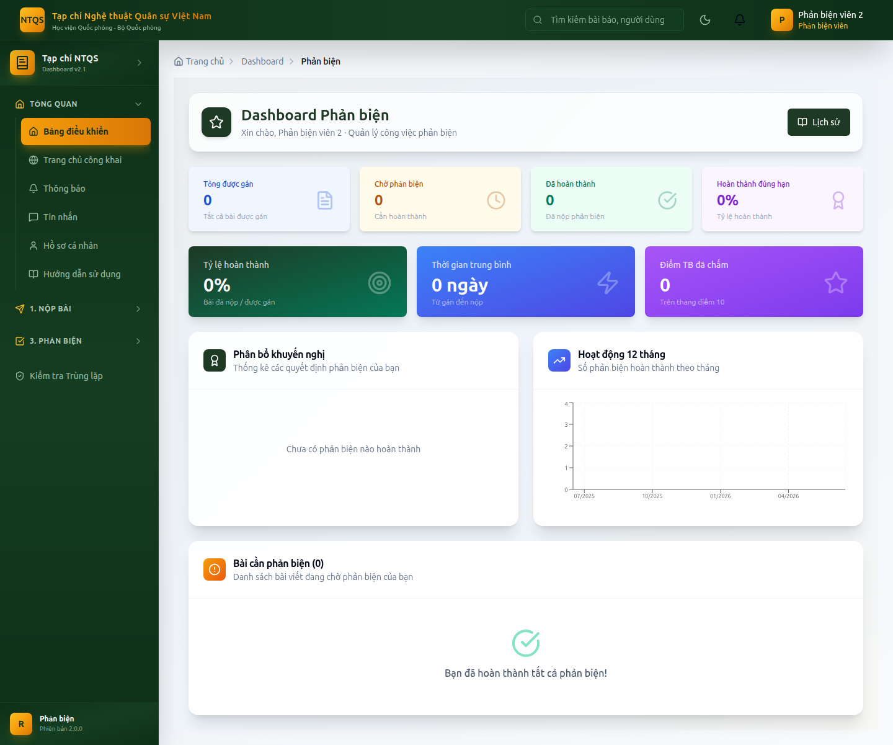
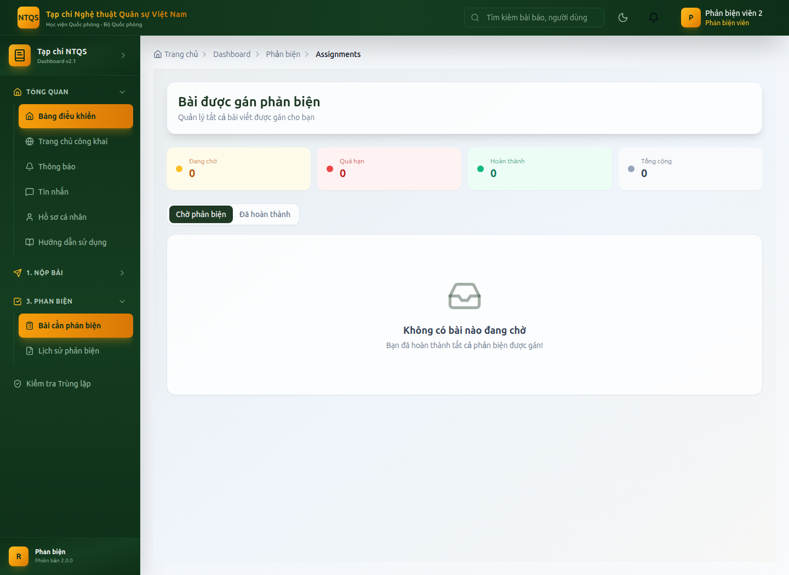

# HƯỚNG DẪN SỬ DỤNG — VAI TRÒ PHẢN BIỆN VIÊN
## Hệ thống Tạp chí điện tử — Tạp chí Nghệ thuật Quân sự Việt Nam (Học viện Quốc phòng)

> Tài liệu dành cho **Phản biện viên (REVIEWER)** — đánh giá độc lập chất lượng khoa học
> của bài nộp theo nguyên tắc phản biện kín. Xem thêm: `docs/huong-dan/README.md`.

---

## MỤC LỤC
1. [Đăng nhập](#1-đăng-nhập)
2. [Bảng điều khiển Phản biện viên](#2-bảng-điều-khiển-phản-biện-viên)
3. [Nhận hoặc từ chối lời mời phản biện](#3-nhận-hoặc-từ-chối-lời-mời-phản-biện)
4. [Thực hiện & nộp phản biện](#4-thực-hiện--nộp-phản-biện)
5. [Sửa phản biện & vòng phản biện thứ 2](#5-sửa-phản-biện--vòng-phản-biện-thứ-2)
6. [Lịch sử phản biện & kiểm tra trùng lặp](#6-lịch-sử-phản-biện--kiểm-tra-trùng-lặp)
7. [Nguyên tắc bắt buộc](#7-nguyên-tắc-bắt-buộc)

---

## 1. Đăng nhập
Vào `/auth/login` (demo: `phanbien2@tapchintqsvn.edu.vn` / `TapChi@2025`) → vào **Bảng điều khiển Phản biện viên** (`/dashboard/reviewer`).

---

## 2. Bảng điều khiển Phản biện viên
**Vào:** **Tổng quan → Bảng điều khiển** (`/dashboard/reviewer`).

Hiển thị: số lời mời chờ phản hồi, bài đang phản biện, deadline sắp tới, và các chỉ số hiệu suất (tỷ lệ hoàn thành, số ngày trung bình, điểm chất lượng/uy tín), biểu đồ phân bố khuyến nghị.

---

## 3. Nhận hoặc từ chối lời mời phản biện
**Vào:** **3. Phản Biện → Bài cần phản biện** (`/dashboard/reviewer/assignments`).

1. Mở lời mời → xem tóm tắt, lĩnh vực, deadline.
2. Chọn **Nhận lời mời** (Accept) hoặc **Từ chối** (Decline, nêu lý do).
3. Khi nhận, bài chuyển vào danh sách đang phản biện của bạn.

> Bài được gửi ẩn danh tác giả (blind review). Nếu phát hiện **xung đột lợi ích**, hãy từ chối và nêu lý do.

---

## 4. Thực hiện & nộp phản biện
1. Mở bài đã nhận → đọc/tải bản thảo (xem PDF trực tiếp).
2. Điền **biểu mẫu phản biện**: nhận xét chi tiết + **khuyến nghị**:
   - **Chấp nhận**, **Chỉnh sửa nhỏ**, **Chỉnh sửa lớn**, hoặc **Từ chối**.
3. Có thể **Lưu nháp** để hoàn thiện sau, hoặc **Nộp phản biện** khi hoàn tất.
4. Sau khi nộp, kết quả chuyển tới biên tập viên để ra quyết định.

---

## 5. Sửa phản biện & vòng phản biện thứ 2
- **Sửa tới khi có quyết định:** sau khi nộp, bạn vẫn có thể **chỉnh sửa phản biện** cho tới khi biên tập viên chốt quyết định (sau đó phản biện bị khóa, chỉ đọc).
- **Vòng 2 (re-review):** nếu tác giả nộp bản chỉnh sửa, bạn có thể được mời phản biện lại — hệ thống hiển thị **ngữ cảnh vòng trước** (bản cũ, nhận xét cũ) để đối chiếu.

---

## 6. Lịch sử phản biện & kiểm tra trùng lặp
- **Lịch sử phản biện:** **3. Phản Biện → Lịch sử phản biện** (`/dashboard/reviewer/history`) — các bài đã phản biện và kết quả.
- **Kiểm tra trùng lặp:** **Kiểm tra Trùng lặp → Kiểm tra trùng lặp** (`/dashboard/repository/duplicate-check`) — hỗ trợ đối chiếu khi nghi ngờ trùng nội dung.

---

## 7. Nguyên tắc bắt buộc
- ❌ **Không liên hệ trực tiếp tác giả** (blind review) — mọi trao đổi qua biên tập viên.
- ❌ Không tiết lộ nội dung bài cho bên thứ ba.
- ✅ Nộp đúng **deadline**; nếu cần gia hạn, báo biên tập viên sớm.
- ✅ Nhận xét khách quan, có căn cứ khoa học, đúng đặc thù nghệ thuật quân sự.

---

> **Tài khoản demo:** `phanbien2@tapchintqsvn.edu.vn` / `TapChi@2025`.
