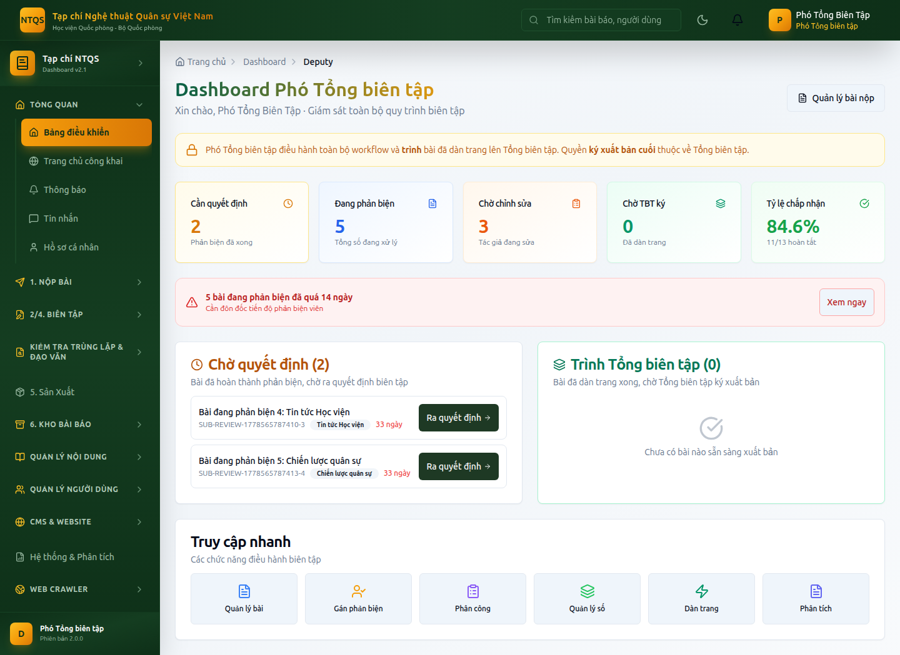

# HƯỚNG DẪN SỬ DỤNG — VAI TRÒ PHÓ TỔNG BIÊN TẬP
## Hệ thống Tạp chí điện tử — Tạp chí Nghệ thuật Quân sự Việt Nam (Học viện Quốc phòng)

> Tài liệu dành cho **Phó Tổng biên tập (DEPUTY_EIC)** — điều hành **toàn bộ** quy trình biên tập
> ngang Tổng biên tập, **trừ quyền ký xuất bản cuối** (thuộc về Tổng biên tập).
> Xem thêm bản đầy đủ của Tổng biên tập: `docs/huong-dan/tong-bien-tap.md`.

---

## MỤC LỤC
1. [Vai trò & ranh giới quyền](#1-vai-trò--ranh-giới-quyền)
2. [Đăng nhập](#2-đăng-nhập)
3. [Bảng điều khiển Phó Tổng biên tập](#3-bảng-điều-khiển-phó-tổng-biên-tập)
4. [Xử lý bài nộp & ra quyết định](#4-xử-lý-bài-nộp--ra-quyết-định)
5. [Phân công biên tập viên](#5-phân-công-biên-tập-viên)
6. [Gán phản biện viên](#6-gán-phản-biện-viên)
7. [Quy trình & Deadline](#7-quy-trình--deadline)
8. [Kiểm tra đạo văn & trùng lặp](#8-kiểm-tra-đạo-văn--trùng-lặp)
9. [Sản xuất & TRÌNH Tổng biên tập ký](#9-sản-xuất--trình-tổng-biên-tập-ký)
10. [Quản lý nội dung, kho bài báo, người dùng, CMS](#10-quản-lý-nội-dung-kho-bài-báo-người-dùng-cms)
11. [Những gì Phó Tổng biên tập KHÔNG làm](#11-những-gì-phó-tổng-biên-tập-không-làm)

---

## 1. Vai trò & ranh giới quyền

Phó Tổng biên tập là cấp phó trực tiếp của Tổng biên tập, **giám sát toàn tòa soạn**:

| Được làm | Không được làm |
|---|---|
| Thấy **tất cả** bài nộp | ❌ **Ký xuất bản cuối** (chỉ Tổng biên tập) |
| Ra quyết định biên tập (chấp nhận/sửa/từ chối) | ❌ Cấu hình phân quyền RBAC |
| Phân công biên tập viên, gán phản biện | ❌ Đổi vai trò người dùng lên cấp cao |
| Đưa bài vào sản xuất (dàn trang) | ❌ Ghi đè quyết định kiểu Tổng biên tập |
| Quản lý số/tập/chuyên mục/từ khóa/metadata | ❌ Thống kê & phân tích cấp hệ thống (EIC) |
| Quản lý người dùng, phản biện viên, CMS | ❌ Cài đặt quy trình phản biện toàn cục (EIC) |

> 🔑 Hãy hiểu vai trò Phó TBT là **"người điều hành thường trực"**: chạy toàn bộ quy trình tới khi bài
> sẵn sàng, rồi **trình Tổng biên tập ký xuất bản**.

---

## 2. Đăng nhập

1. Vào `/auth/login`, nhập tài khoản Phó Tổng biên tập (demo: `photongbientap@tapchintqsvn.edu.vn` / `TapChi@2025`).
2. Nhập mã 2FA nếu đã bật.
3. Hệ thống đưa vào **Bảng điều khiển Phó Tổng biên tập** (`/dashboard/deputy`).

---

## 3. Bảng điều khiển Phó Tổng biên tập

**Vào:** **Tổng quan → Bảng điều khiển** (`/dashboard/deputy`).

Gồm:
- **Dải nhắc ranh giới quyền** (vàng): nhắc rằng bước ký xuất bản cuối thuộc Tổng biên tập.
- **5 thẻ KPI:** *Cần quyết định*, *Đang phản biện*, *Chờ chỉnh sửa*, *Chờ TBT ký*, *Tỷ lệ chấp nhận*.
- **Cảnh báo quá hạn:** bài phản biện quá 14 ngày → nút *Xem ngay*.
- **Hàng chờ quyết định:** bài đã đủ phản biện → nút **Ra quyết định**.
- **Hàng "Trình Tổng biên tập":** bài đã dàn trang xong, chờ Tổng biên tập ký — chỉ có nút **Theo dõi** (không có nút xuất bản).
- **Truy cập nhanh:** Quản lý bài, Gán phản biện, Phân công, Quản lý số, Dàn trang, Phân tích.

---

## 4. Xử lý bài nộp & ra quyết định

**Vào:** **2/4. Biên Tập → Bài cần xử lý** (`/dashboard/editor/submissions`).

Quy trình giống hệt mục 4 của hướng dẫn Tổng biên tập:
1. Mở danh sách (thấy **tất cả** bài), lọc theo trạng thái/từ khóa.
2. Mở chi tiết một bài → xem file, phản biện, mốc thời gian.
3. Khi đủ phản biện → khối **Ra quyết định**: *Chấp nhận* / *Yêu cầu chỉnh sửa (nhỏ/lớn)* / *Từ chối*, kèm nhận xét.
4. Dùng được các nút chuyển giai đoạn: *Gửi phản biện*, *Từ chối sơ bộ*, *Đưa vào sản xuất*.

> Quyết định được ghi nhật ký kiểm toán và gửi thông báo cho tác giả như bình thường.

---

## 5. Phân công biên tập viên

**Vào:** **2/4. Biên Tập → Phân công biên tập** (`/dashboard/managing/assignments`).
Giao bài cho biên tập viên chuyên mục, cân đối khối lượng công việc (xem chi tiết ở hướng dẫn Tổng biên tập, mục 5).

---

## 6. Gán phản biện viên

**Vào:** **2/4. Biên Tập → Gán phản biện** (`/dashboard/editor/assign-reviewers`).
Chọn **tối thiểu 2** phản biện viên đủ điều kiện; hệ thống gợi ý theo lĩnh vực, tự loại tác giả, áp dụng phản biện kín.

---

## 7. Quy trình & Deadline

**Vào:** **2/4. Biên Tập → Quy trình & Deadline** (`/dashboard/editor/workflow`).
Theo dõi deadline & lịch sử chuyển trạng thái của từng bài; đôn đốc bài trễ hạn.

---

## 8. Kiểm tra đạo văn & trùng lặp

**Vào:** **Kiểm tra Trùng lặp & Đạo văn** → *Kiểm tra Đạo văn* (`/dashboard/plagiarism`) và *Kiểm tra trùng lặp* (`/dashboard/repository/duplicate-check`).

---

## 9. Sản xuất & TRÌNH Tổng biên tập ký

**Vào:** **5. Sản Xuất → Hàng đợi Sản xuất** (`/dashboard/layout/production`).

Phó Tổng biên tập:
- **Được:** đưa bài đã chấp nhận vào sản xuất, theo dõi dàn trang, gán bài vào số, hoàn tất hiệu đính/metadata.
- **Không được:** nhấn nút **Xuất bản** (nút này chỉ hiện cho Tổng biên tập). Khi bài đã sẵn sàng, bài nằm ở hàng **"Chờ TBT ký"** trên bảng điều khiển — báo Tổng biên tập vào ký.

> Nếu cố gọi chức năng xuất bản, hệ thống trả lỗi *"chỉ Tổng biên tập hoặc Quản trị hệ thống được xuất bản"*.

---

## 10. Quản lý nội dung, kho bài báo, người dùng, CMS

Phó Tổng biên tập có quyền điều hành các khu vực sau (thao tác như mô tả trong hướng dẫn Tổng biên tập):

| Khu vực | Mục menu |
|---|---|
| **Quản lý Nội dung** | Số Tạp chí, Tập, Chuyên mục, Từ khóa, Metadata & Xuất bản |
| **6. Kho Bài Báo** | CSDL Báo chí, Bài báo lịch sử, Tất cả Bài báo, Báo cáo công bố, Tìm kiếm Nâng cao |
| **Quản lý Người dùng** | Tất cả Người dùng, Phản biện viên, Phiên đăng nhập *(không có mục Quyền RBAC)* |
| **CMS & Website** | Trang chủ, Trang công khai, Tin tức, Thông báo, Banner, Media, Video, Podcast, Menu, Cài đặt Website |
| **Hệ thống & Phân tích** | *(chỉ)* Báo cáo & Export |
| **Web Crawler** | Nguồn Web Crawl, Nội dung đã Crawl |

---

## 11. Những gì Phó Tổng biên tập KHÔNG làm

- ❌ **Ký xuất bản** bài/số tạp chí — luôn thuộc Tổng biên tập (+ Quản trị hệ thống).
- ❌ **Cấu hình phân quyền RBAC** (`/dashboard/admin/permissions`) — chỉ Tổng biên tập / Quản trị hệ thống.
- ❌ **Thống kê Tổng quan / Phân tích Chi tiết / Cài đặt Phản biện** cấp hệ thống — thuộc Tổng biên tập.
- ❌ **Cảnh báo & nhật ký bảo mật/kiểm toán** — thuộc Kiểm định bảo mật / Tổng biên tập / Quản trị hệ thống.
- ❌ **Hoàn tất quy tắc bài mật (SECRET)**: chữ ký của Phó TBT không thay được chữ ký Tổng biên tập trong quy tắc hai người (TBT + Kiểm định bảo mật).
- ❌ **Gán/nâng người khác lên vai trò cấp cao** (Phó TBT, Tổng biên tập, Kiểm định bảo mật, Quản trị) — chỉ Quản trị hệ thống.

---

> **Tài khoản demo:** `photongbientap@tapchintqsvn.edu.vn` / `TapChi@2025`.
> Tài liệu liên quan: `tong-bien-tap.md`, `thu-ky-toa-soan.md`, `../qa/leadership-flow-checklist.md`.
