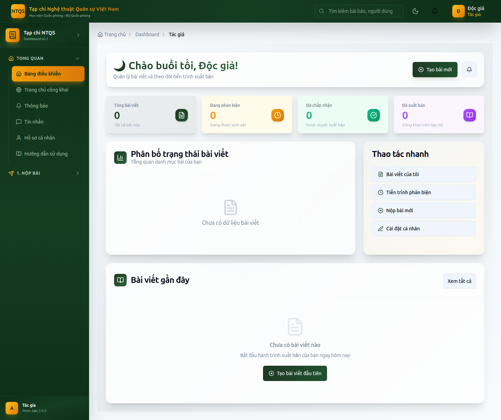
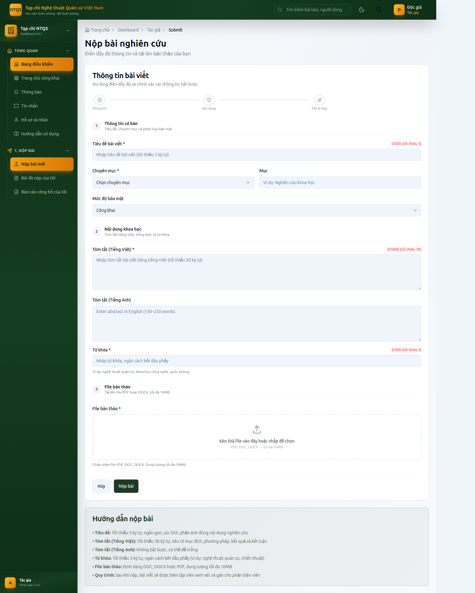
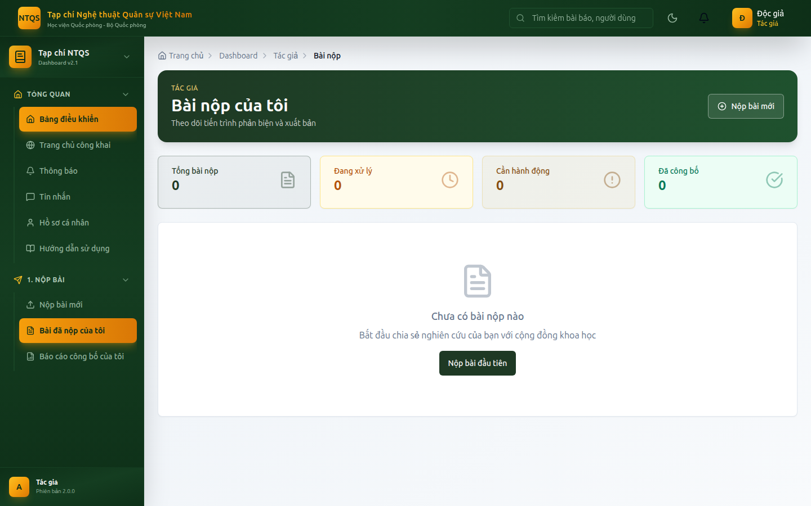

# HƯỚNG DẪN SỬ DỤNG — VAI TRÒ TÁC GIẢ
## Hệ thống Tạp chí điện tử — Tạp chí Nghệ thuật Quân sự Việt Nam (Học viện Quốc phòng)

> Tài liệu dành cho **Tác giả (AUTHOR)** — người gửi bài nghiên cứu, theo dõi quá trình
> phản biện và phản hồi yêu cầu chỉnh sửa. Xem thêm: `docs/huong-dan/README.md`.

---

## MỤC LỤC
1. [Đăng nhập & hồ sơ](#1-đăng-nhập--hồ-sơ)
2. [Bảng điều khiển Tác giả](#2-bảng-điều-khiển-tác-giả)
3. [Nộp bài mới](#3-nộp-bài-mới)
4. [Theo dõi trạng thái bài](#4-theo-dõi-trạng-thái-bài)
5. [Phản hồi yêu cầu chỉnh sửa (nộp bản sửa)](#5-phản-hồi-yêu-cầu-chỉnh-sửa-nộp-bản-sửa)
6. [Báo cáo công bố của tôi](#6-báo-cáo-công-bố-của-tôi)
7. [Lưu ý quan trọng](#7-lưu-ý-quan-trọng)

---

## 1. Đăng nhập & hồ sơ
1. Vào `/auth/login`, nhập email + mật khẩu (demo: `docgia@tapchintqsvn.edu.vn` / `TapChi@2025`).
2. Hệ thống đưa vào **Bảng điều khiển Tác giả** (`/dashboard/author`).
3. Cập nhật thông tin cá nhân, ORCID, đơn vị tại **Tổng quan → Hồ sơ cá nhân**. Thông tin đầy đủ giúp biên tập viên liên hệ và ghi nhận công bố chính xác.

---

## 2. Bảng điều khiển Tác giả
**Vào:** **Tổng quan → Bảng điều khiển** (`/dashboard/author`).

Hiển thị: số bài đã nộp, đang phản biện, đã xuất bản; tiến trình từng bài; deadline sắp tới (vd hạn nộp bản chỉnh sửa); bài gần đây.

---

## 3. Nộp bài mới
**Vào:** **1. Nộp Bài → Nộp bài mới** (`/dashboard/author/submit`).

**Các bước:**
1. Nhập **tiêu đề**, **tóm tắt** (tiếng Việt/tiếng Anh), **từ khóa**.
2. Chọn **chuyên mục** phù hợp (Chiến lược quân sự, Nghệ thuật tác chiến, Chiến dịch học, Chiến thuật học, Lịch sử quân sự…).
3. Khai báo **đồng tác giả** (nếu có).
4. **Tải lên tệp bản thảo** (định dạng & dung lượng theo quy định; hệ thống kiểm tra loại tệp).
5. Kiểm tra lại và **Gửi bài** → bài nhận trạng thái **Mới nộp (NEW)** và được cấp **mã bài**.

> Sau khi gửi, bài chờ biên tập viên sàng lọc. Bạn nhận thông báo khi có thay đổi trạng thái.

---

## 4. Theo dõi trạng thái bài
**Vào:** **1. Nộp Bài → Bài đã nộp của tôi** (`/dashboard/author/submissions`).

Mỗi bài hiển thị trạng thái theo vòng đời:

| Trạng thái | Ý nghĩa với tác giả |
|---|---|
| Mới nộp | Đang chờ sàng lọc |
| Đang phản biện | Đã gửi tới phản biện viên |
| Cần chỉnh sửa | Cần bạn sửa và nộp lại (xem mục 5) |
| Chấp nhận | Bài được duyệt nội dung |
| Đang sản xuất | Đang dàn trang, chuẩn bị xuất bản |
| Đã xuất bản | Bài đã lên tạp chí |
| Từ chối sơ bộ / Từ chối | Bài không tiếp tục (kèm lý do) |

Mở chi tiết một bài để xem nhận xét biên tập, kết quả phản biện (đã ẩn danh) và lịch sử xử lý.

---

## 5. Phản hồi yêu cầu chỉnh sửa (nộp bản sửa)
Khi bài ở trạng thái **Cần chỉnh sửa (REVISION)**:
1. Mở bài → đọc **nhận xét/yêu cầu** của biên tập và phản biện.
2. Nhấn **Nộp bản chỉnh sửa**.
3. **Tải lên bản thảo mới** và viết **thư phản hồi** nêu rõ đã sửa những gì (response-to-reviewers).
4. Gửi → bài tạo **phiên bản mới** và quay lại vòng phản biện.

> Lưu ý: cần nộp bản sửa **trước deadline** hiển thị trên bảng điều khiển. Thư phản hồi và tệp đính kèm được lưu kèm phiên bản để biên tập viên đối chiếu.

---

## 6. Báo cáo công bố của tôi
**Vào:** **1. Nộp Bài → Báo cáo công bố của tôi** (`/dashboard/reports/publications?mode=author`).

Xuất danh mục bài đã công bố của bạn (DOCX/XLSX/PDF) để tổng hợp thành tích cá nhân.

---

## 7. Lưu ý quan trọng
- **Phản biện kín (blind review):** tác giả **không** trao đổi trực tiếp với phản biện viên. Mọi liên hệ qua biên tập viên (mục Tin nhắn).
- **Không trùng lặp/đạo văn:** bài có thể bị kiểm tra đạo văn; hãy đảm bảo tính nguyên gốc.
- **Một tài khoản nhiều vai trò:** nếu bạn cũng là phản biện viên, hệ thống tự loại bạn khỏi việc phản biện chính bài của mình.

---

> **Tài khoản demo:** `docgia@tapchintqsvn.edu.vn` / `TapChi@2025`.
