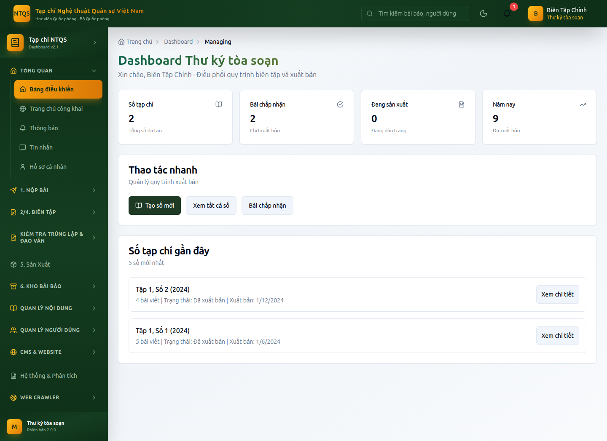
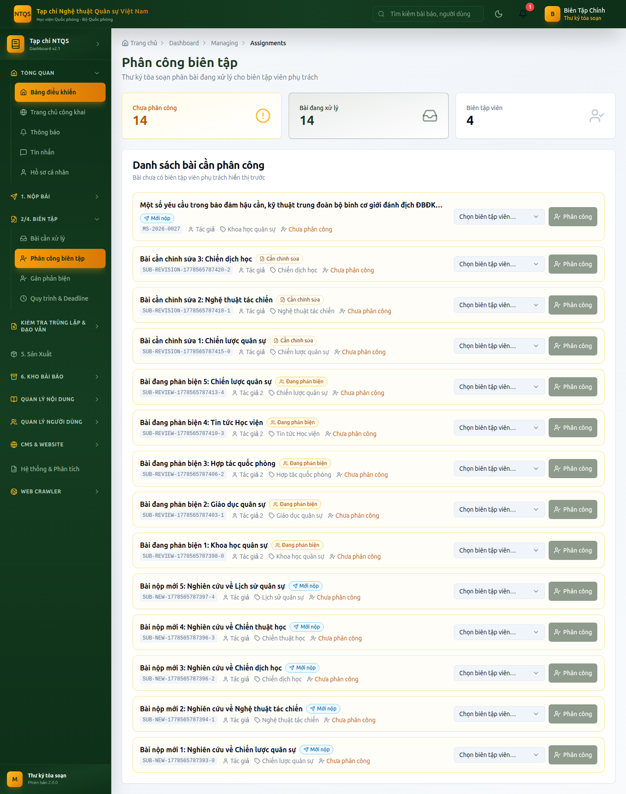

# HƯỚNG DẪN SỬ DỤNG — VAI TRÒ THƯ KÝ TÒA SOẠN (BIÊN TẬP VIÊN CHÍNH)
## Hệ thống Tạp chí điện tử — Tạp chí Nghệ thuật Quân sự Việt Nam (Học viện Quốc phòng)

> Tài liệu dành cho **Thư ký tòa soạn / Biên tập viên chính (MANAGING_EDITOR)** — người **điều phối**
> hằng ngày của tòa soạn: phân công bài, theo dõi phản biện, ra quyết định, dàn trang và chuẩn bị số tạp chí.
> Quyền **ký xuất bản cuối** thuộc Tổng biên tập. Xem thêm: `tong-bien-tap.md`, `pho-tong-bien-tap.md`.

---

## MỤC LỤC
1. [Vai trò & trọng tâm công việc](#1-vai-trò--trọng-tâm-công-việc)
2. [Đăng nhập](#2-đăng-nhập)
3. [Bảng điều khiển Thư ký tòa soạn](#3-bảng-điều-khiển-thư-ký-tòa-soạn)
4. [Phân công biên tập viên (việc cốt lõi)](#4-phân-công-biên-tập-viên-việc-cốt-lõi)
5. [Gán phản biện & theo dõi tiến độ](#5-gán-phản-biện--theo-dõi-tiến-độ)
6. [Ra quyết định biên tập](#6-ra-quyết-định-biên-tập)
7. [Quản lý Số tạp chí & dàn trang](#7-quản-lý-số-tạp-chí--dàn-trang)
8. [Kiểm tra đạo văn & trùng lặp](#8-kiểm-tra-đạo-văn--trùng-lặp)
9. [Nội dung, kho bài báo, người dùng, CMS](#9-nội-dung-kho-bài-báo-người-dùng-cms)
10. [Những gì Thư ký tòa soạn KHÔNG làm](#10-những-gì-thư-ký-tòa-soạn-không-làm)

---

## 1. Vai trò & trọng tâm công việc

Thư ký tòa soạn là **đầu mối điều phối** quy trình biên tập. Trọng tâm:
- **Tiếp nhận & phân công** bài nộp cho biên tập viên chuyên mục.
- **Điều phối phản biện** và **theo dõi deadline**, đôn đốc bài trễ.
- **Ra quyết định biên tập** khi cần và **chuẩn bị số tạp chí** (gom bài, dàn trang).
- Trình bài đã hoàn tất lên Phó Tổng biên tập / Tổng biên tập để ký xuất bản.

| Được làm | Không được làm |
|---|---|
| Thấy **tất cả** bài nộp | ❌ **Ký xuất bản cuối** (chỉ Tổng biên tập) |
| Phân công biên tập viên | ❌ Cấu hình phân quyền RBAC |
| Gán phản biện, ra quyết định | ❌ Thống kê/Phân tích & Cài đặt phản biện cấp hệ thống (EIC) |
| Quản lý số/tập/chuyên mục/metadata, dàn trang | ❌ Nhật ký bảo mật/kiểm toán |
| Quản lý người dùng (trừ RBAC), CMS | ❌ Hoàn tất quy tắc bài mật thay Tổng biên tập |

---

## 2. Đăng nhập

1. Vào `/auth/login`, nhập tài khoản Thư ký tòa soạn (demo: `bientapchinh@tapchintqsvn.edu.vn` / `TapChi@2025`).
2. Nhập mã 2FA nếu đã bật.
3. Hệ thống đưa vào **Bảng điều khiển Thư ký tòa soạn** (`/dashboard/managing`).

---

## 3. Bảng điều khiển Thư ký tòa soạn

**Vào:** **Tổng quan → Bảng điều khiển** (`/dashboard/managing`).

Gồm:
- **4 thẻ KPI:** *Số tạp chí* (tổng đã tạo), *Bài chấp nhận* (chờ xuất bản), *Đang sản xuất* (đang dàn trang), *Năm nay* (số bài đã xuất bản trong năm).
- **Thao tác nhanh:** *Tạo số mới*, *Quản lý số*…
- **Số tạp chí gần đây:** danh sách số mới nhất kèm số lượng bài.

> Để xem hàng chờ quyết định/khối lượng biên tập viên chi tiết, vào **2/4. Biên Tập → Bài cần xử lý** và **Phân công biên tập**.

---

## 4. Phân công biên tập viên (việc cốt lõi)

**Vào:** **2/4. Biên Tập → Phân công biên tập** (`/dashboard/managing/assignments`).

**Các bước:**
1. Xem danh sách bài **chưa có người phụ trách**.
2. Với mỗi bài, chọn một biên tập viên chuyên mục (kèm thông tin khối lượng công việc hiện tại để cân đối đều).
3. Xác nhận → hệ thống gán biên tập viên phụ trách + tạo deadline xử lý.

> Đây là chức năng đặc trưng nhất của Thư ký tòa soạn: phân bổ bài hợp lý, tránh dồn việc, đảm bảo mỗi bài có người chịu trách nhiệm.

---

## 5. Gán phản biện & theo dõi tiến độ

- **Gán phản biện:** **2/4. Biên Tập → Gán phản biện** (`/dashboard/editor/assign-reviewers`) — chọn **≥2** phản biện viên; hệ thống gợi ý theo lĩnh vực, tự loại tác giả, áp dụng phản biện kín.
- **Theo dõi tiến độ:** **2/4. Biên Tập → Quy trình & Deadline** (`/dashboard/editor/workflow`) — xem deadline phản biện/quyết định/nộp bản sửa; đôn đốc bài trễ.

---

## 6. Ra quyết định biên tập

**Vào:** **2/4. Biên Tập → Bài cần xử lý** (`/dashboard/editor/submissions`) → mở bài.

Khi đủ phản biện, dùng khối **Ra quyết định**: *Chấp nhận* / *Yêu cầu chỉnh sửa (nhỏ/lớn)* / *Từ chối* kèm nhận xét.
Dùng được các nút chuyển giai đoạn: *Gửi phản biện*, *Từ chối sơ bộ*, *Đưa vào sản xuất*.

---

## 7. Quản lý Số tạp chí & dàn trang

- **Số Tạp chí:** **Quản lý Nội dung → Số Tạp chí** (`/dashboard/admin/issues`) — tạo số, gom bài *Đã chấp nhận/Đang sản xuất* vào số, lên lịch.
- **Tập (Volumes):** `/dashboard/admin/volumes`.
- **Dàn trang / Sản xuất:** **5. Sản Xuất → Hàng đợi Sản xuất** (`/dashboard/layout/production`) — đưa bài vào sản xuất, theo dõi hiệu đính, hoàn tất metadata.

> Thư ký tòa soạn chuẩn bị mọi thứ tới khi bài **sẵn sàng xuất bản**, sau đó **Tổng biên tập ký** (Thư ký không thấy nút Xuất bản).

---

## 8. Kiểm tra đạo văn & trùng lặp

**Vào:** **Kiểm tra Trùng lặp & Đạo văn** → *Kiểm tra Đạo văn* (`/dashboard/plagiarism`) và *Kiểm tra trùng lặp* (`/dashboard/repository/duplicate-check`).

---

## 9. Nội dung, kho bài báo, người dùng, CMS

| Khu vực | Mục menu |
|---|---|
| **Quản lý Nội dung** | Số Tạp chí, Tập, Chuyên mục, Từ khóa, Metadata & Xuất bản |
| **6. Kho Bài Báo** | CSDL Báo chí, Bài báo lịch sử, Tất cả Bài báo, Báo cáo công bố, Tìm kiếm Nâng cao |
| **Quản lý Người dùng** | Tất cả Người dùng, Phản biện viên, Phiên đăng nhập *(không có mục Quyền RBAC)* |
| **CMS & Website** | Trang chủ, Trang công khai, Tin tức, Thông báo, Banner, Media, Video, Podcast, Menu, Cài đặt Website |
| **Hệ thống & Phân tích** | *(chỉ)* Báo cáo & Export |
| **Web Crawler** | Nguồn Web Crawl, Nội dung đã Crawl |

> **Duyệt tài khoản mới:** vào *Tất cả Người dùng* → lọc *Chờ duyệt* → chọn vai trò (từ Biên tập viên trở xuống) → *Phê duyệt*.

---

## 10. Những gì Thư ký tòa soạn KHÔNG làm

- ❌ **Ký xuất bản** (chỉ Tổng biên tập + Quản trị hệ thống).
- ❌ **Cấu hình phân quyền RBAC**, **Thống kê/Phân tích cấp hệ thống**, **Cài đặt quy trình phản biện** (thuộc Tổng biên tập).
- ❌ **Nhật ký bảo mật/kiểm toán & cảnh báo bảo mật** (thuộc Kiểm định bảo mật/Tổng biên tập/Quản trị).
- ❌ **Gán/nâng vai trò cấp cao** (Phó TBT, Tổng biên tập, Kiểm định bảo mật, Quản trị) — chỉ Quản trị hệ thống.
- ❌ **Hoàn tất quy tắc bài mật (SECRET)** — cần chữ ký Tổng biên tập + Kiểm định bảo mật.

---

> **Tài khoản demo:** `bientapchinh@tapchintqsvn.edu.vn` / `TapChi@2025`.
> Tài liệu liên quan: `tong-bien-tap.md`, `pho-tong-bien-tap.md`, `../qa/leadership-flow-checklist.md`.
