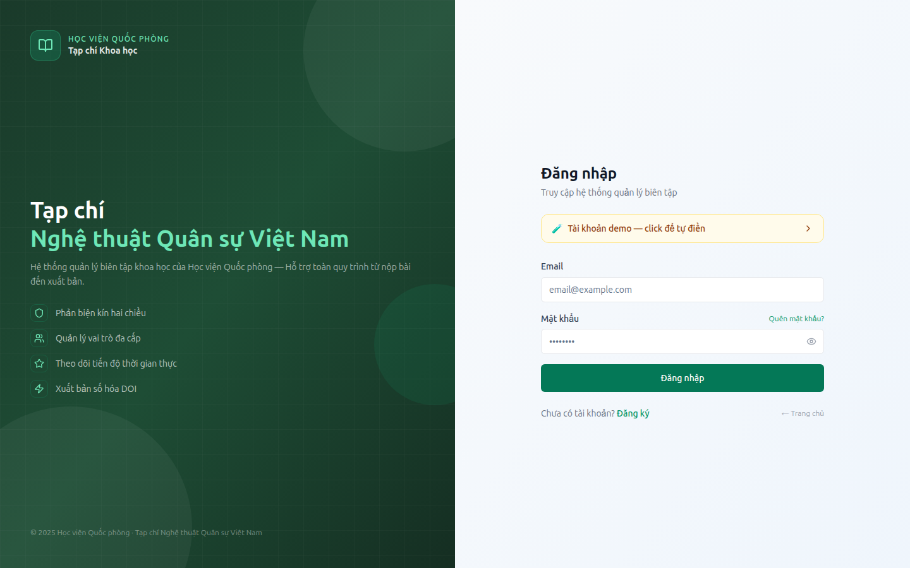
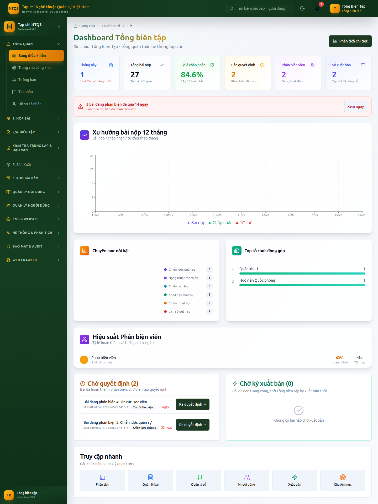
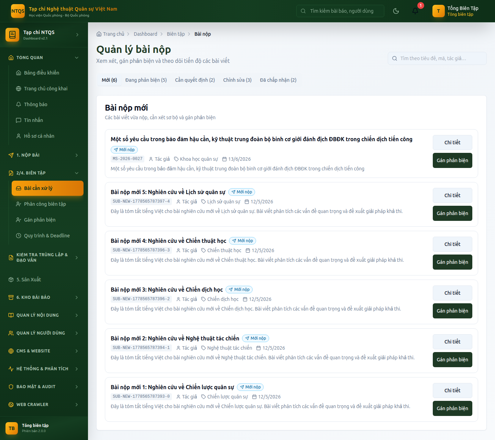
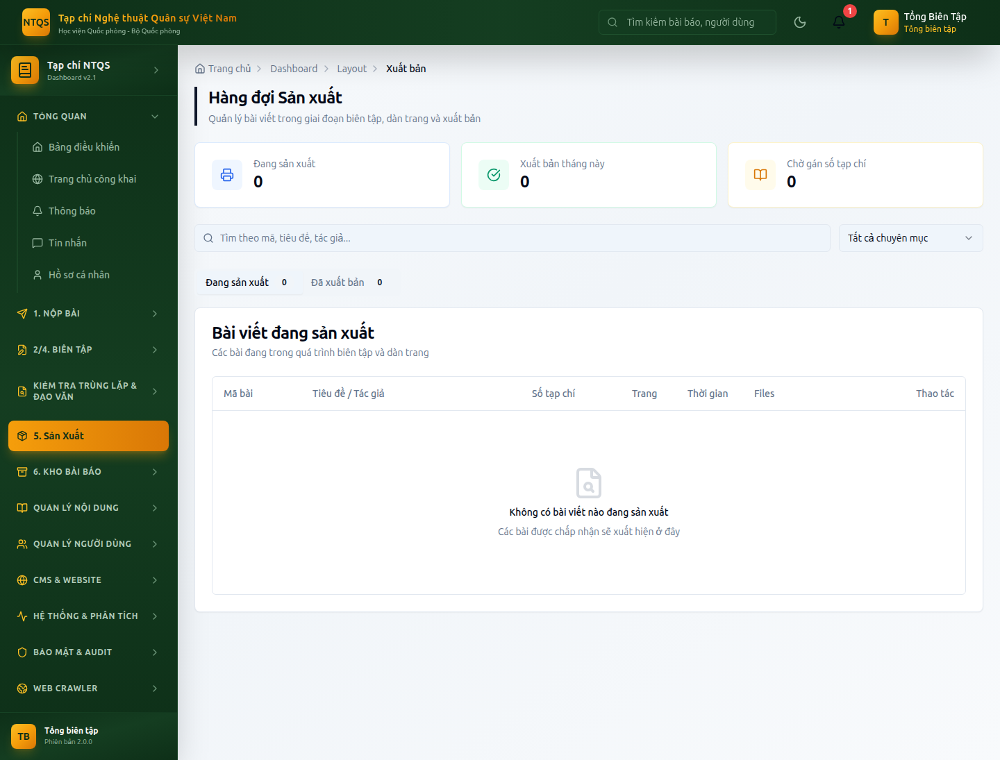
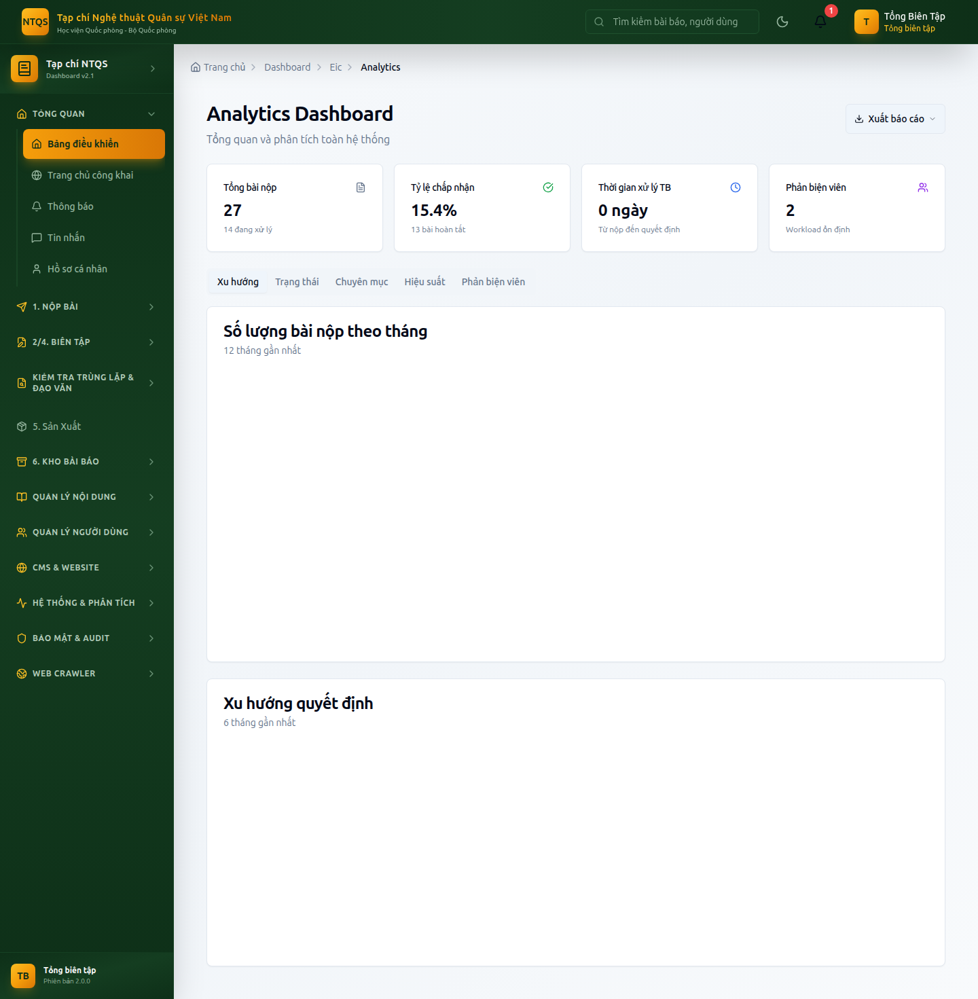

# HƯỚNG DẪN SỬ DỤNG — VAI TRÒ TỔNG BIÊN TẬP
## Hệ thống Tạp chí điện tử — Tạp chí Nghệ thuật Quân sự Việt Nam (Học viện Quốc phòng)

> Tài liệu dành cho **Tổng biên tập (EIC)** — vai trò có thẩm quyền cao nhất về nội dung
> và là người **duy nhất ký xuất bản** bài báo/số tạp chí (cùng Quản trị hệ thống).
> Mỗi mục mô tả: *chức năng → vào đâu → các bước thao tác → lưu ý nghiệp vụ*.

---

## MỤC LỤC

1. [Đăng nhập & bảo mật tài khoản](#1-đăng-nhập--bảo-mật-tài-khoản)
2. [Bảng điều khiển Tổng biên tập](#2-bảng-điều-khiển-tổng-biên-tập)
3. [Toàn cảnh quy trình biên tập (vòng đời bài)](#3-toàn-cảnh-quy-trình-biên-tập-vòng-đời-bài)
4. [Xử lý bài nộp & ra quyết định biên tập](#4-xử-lý-bài-nộp--ra-quyết-định-biên-tập)
5. [Phân công biên tập viên](#5-phân-công-biên-tập-viên)
6. [Gán phản biện viên](#6-gán-phản-biện-viên)
7. [Quy trình & Deadline](#7-quy-trình--deadline)
8. [Kiểm tra đạo văn & trùng lặp](#8-kiểm-tra-đạo-văn--trùng-lặp)
9. [Sản xuất & KÝ XUẤT BẢN](#9-sản-xuất--ký-xuất-bản)
10. [Quy tắc bài mật (hai người ký)](#10-quy-tắc-bài-mật-hai-người-ký)
11. [Quản lý nội dung: Số, Tập, Chuyên mục, Từ khóa, Metadata](#11-quản-lý-nội-dung-số-tập-chuyên-mục-từ-khóa-metadata)
12. [Kho bài báo & Báo cáo công bố](#12-kho-bài-báo--báo-cáo-công-bố)
13. [Quản lý người dùng, phản biện viên, phân quyền](#13-quản-lý-người-dùng-phản-biện-viên-phân-quyền)
14. [CMS & Website công khai](#14-cms--website-công-khai)
15. [Hệ thống & Phân tích](#15-hệ-thống--phân-tích)
16. [Bảo mật & Nhật ký kiểm toán](#16-bảo-mật--nhật-ký-kiểm-toán)
17. [Web Crawler (thu thập nội dung)](#17-web-crawler-thu-thập-nội-dung)
18. [Câu hỏi thường gặp](#18-câu-hỏi-thường-gặp)

---

## 1. Đăng nhập & bảo mật tài khoản

**Mục đích:** truy cập hệ thống với quyền Tổng biên tập.

**Các bước:**
1. Mở trang `/auth/login`.
2. Nhập email và mật khẩu tài khoản Tổng biên tập (ví dụ tài khoản demo: `tongbientap@tapchintqsvn.edu.vn`).
3. Nếu tài khoản đã bật **Bảo mật 2 lớp (2FA)**, hệ thống yêu cầu nhập mã OTP (qua email) hoặc mã từ ứng dụng Authenticator. Nhập mã để hoàn tất.
4. Sau khi đăng nhập, hệ thống **tự động đưa vào** Bảng điều khiển Tổng biên tập tại `/dashboard/eic`.

**Bật/tắt 2FA và đổi mật khẩu:** vào **Tổng quan → Hồ sơ cá nhân** (`/dashboard/profile`), phần Bảo mật.



> ⚠️ **Khuyến nghị bắt buộc:** Tổng biên tập là tài khoản quyền cao nhất → **nên bật 2FA**.
> Hệ thống có giới hạn số lần đăng nhập sai (chống dò mật khẩu); nếu bị khóa tạm, chờ theo thông báo.

---

## 2. Bảng điều khiển Tổng biên tập

**Vào:** **Tổng quan → Bảng điều khiển** (`/dashboard/eic`).



Đây là màn hình trung tâm, gồm các khối:

### 2.1. Thẻ chỉ số (KPI) — hàng trên cùng
| Thẻ | Ý nghĩa |
|---|---|
| **Tháng này** | Số bài nộp trong tháng + so sánh tăng/giảm với tháng trước |
| **Tổng bài nộp** | Tổng số bài tất cả thời gian |
| **Tỷ lệ chấp nhận** | % bài được chấp nhận trên tổng bài đã có kết luận |
| **Cần quyết định** | Số bài đã phản biện xong, đang chờ ra quyết định |
| **Phản biện viên** | Số phản biện viên đang hoạt động |
| **Số xuất bản** | Số tạp chí đã công bố |

### 2.2. Cảnh báo quá hạn
Nếu có bài đang phản biện **quá 14 ngày**, hệ thống hiển thị dải cảnh báo đỏ kèm nút **Xem ngay** để theo dõi tiến độ.

### 2.3. Biểu đồ phân tích
- **Xu hướng 12 tháng**: số bài nộp / chấp nhận / từ chối theo tháng.
- **Phân bố theo chuyên mục**: chuyên mục nào nhiều bài.
- **Hiệu suất phản biện viên**: tỷ lệ hoàn thành, số ngày trung bình.
- **Top tổ chức tác giả**: cơ quan gửi bài nhiều nhất.

### 2.4. Hai hàng chờ hành động
- **Chờ quyết định**: danh sách bài đã phản biện xong → nhấn **Ra quyết định** để mở bài và kết luận.
- **Chờ ký xuất bản**: bài đã dàn trang xong (trạng thái *Đang sản xuất*) → nhấn **Xuất bản** để sang trang ký xuất bản. *(Đây là đặc quyền của Tổng biên tập.)*

### 2.5. Truy cập nhanh
Các nút tắt: Phân tích, Quản lý bài, Quản lý số, Người dùng, Xuất bản, Chuyên mục.

> **Phân tích chi tiết:** nút **Phân tích chi tiết** (góc trên phải) hoặc menu **Hệ thống & Phân tích → Phân tích Chi tiết** (`/dashboard/eic/analytics`).

---

## 3. Toàn cảnh quy trình biên tập (vòng đời bài)

Mọi bài nộp đi qua các trạng thái sau (Tổng biên tập giám sát toàn bộ):

```
        ┌─ Từ chối sơ bộ (DESK_REJECT) ── (kết thúc)
        │
Mới nộp ─┤
(NEW)   └─ Gửi phản biện (UNDER_REVIEW)
                │
                ├─ Yêu cầu chỉnh sửa (REVISION) ──► tác giả sửa ──► quay lại phản biện
                │                                  └─ (có thể) Từ chối (REJECTED)
                │
                └─ Chấp nhận (ACCEPTED)
                        │
                        └─ Đang sản xuất / dàn trang (IN_PRODUCTION)
                                │
                                └─ ★ Đã xuất bản (PUBLISHED) ★  ← chỉ Tổng biên tập ký
```

| Hành động | Chuyển trạng thái | Ai làm |
|---|---|---|
| Gửi phản biện | NEW → UNDER_REVIEW | Biên tập viên trở lên |
| Từ chối sơ bộ | NEW → DESK_REJECT | Biên tập viên trở lên |
| Ra quyết định: Chấp nhận | UNDER_REVIEW → ACCEPTED | BTV / Thư ký / Phó TBT / **TBT** |
| Ra quyết định: Yêu cầu chỉnh sửa | UNDER_REVIEW → REVISION | nt |
| Ra quyết định: Từ chối | UNDER_REVIEW → REJECTED | nt |
| Đưa vào sản xuất | ACCEPTED → IN_PRODUCTION | Thư ký / Phó TBT / **TBT** |
| **Ký xuất bản** | IN_PRODUCTION → PUBLISHED | **Chỉ Tổng biên tập + Quản trị hệ thống** |

> 🔑 **Điểm mấu chốt:** Biên tập viên chính (Thư ký tòa soạn) và Phó Tổng biên tập điều hành được toàn bộ
> các bước phía trước, **nhưng bước ký xuất bản cuối luôn thuộc về Tổng biên tập**.

---

## 4. Xử lý bài nộp & ra quyết định biên tập

**Vào:** **2/4. Biên Tập → Bài cần xử lý** (`/dashboard/editor/submissions`).



### 4.1. Xem danh sách & lọc
- Danh sách hiển thị theo tab/trạng thái: *Mới*, *Đang phản biện*, *Chờ quyết định*, *Chỉnh sửa*, *Đã chấp nhận*.
- Tìm theo tiêu đề / mã bài / tác giả.
- Tổng biên tập **thấy tất cả bài** (không bị giới hạn theo phân công như biên tập viên chuyên mục).

### 4.2. Mở chi tiết một bài
Nhấn vào bài → trang chi tiết hiển thị: thông tin bài, biên tập viên phụ trách, file PDF (xem trực tiếp), các phản biện đã/đang thực hiện, mốc thời gian.

### 4.3. Ra quyết định biên tập
Khi bài ở trạng thái *Đang phản biện* và **các phản biện đã nộp đủ**, khối **Ra quyết định** hiện ra. Chọn một trong:
- **Chấp nhận** → bài chuyển *Đã chấp nhận* (ACCEPTED).
- **Yêu cầu chỉnh sửa (nhỏ/lớn)** → bài chuyển *Cần chỉnh sửa* (REVISION); hệ thống tạo deadline để tác giả nộp bản sửa.
- **Từ chối** → bài chuyển *Từ chối* (REJECTED).

Nhập **nhận xét/kết luận** kèm theo (gửi tới tác giả). Nhấn xác nhận.

> Hệ thống tự động: gửi thông báo cho tác giả, ghi **nhật ký kiểm toán**, và chống tình huống hai người
> cùng quyết định một lúc (atomic). Quyết định sai trạng thái sẽ bị từ chối.

### 4.4. Các nút chuyển giai đoạn (không phải quyết định)
Trên trang chi tiết còn có nút: **Gửi phản biện**, **Từ chối sơ bộ** (khi bài còn *Mới*), **Đưa vào sản xuất** (khi bài *Đã chấp nhận*). Tổng biên tập dùng được tất cả.

---

## 5. Phân công biên tập viên

**Vào:** **2/4. Biên Tập → Phân công biên tập** (`/dashboard/managing/assignments`).

**Mục đích:** giao bài cho một Biên tập viên chuyên mục phụ trách.

**Các bước:**
1. Chọn bài chưa có người phụ trách.
2. Chọn biên tập viên (kèm thông tin khối lượng công việc hiện tại để cân đối).
3. Xác nhận → hệ thống gán `biên tập viên phụ trách` và tạo deadline xử lý.

> Sau khi phân công, biên tập viên chuyên mục đó mới thấy và xử lý bài được giao.
> Tổng biên tập có thể phân công lại bất cứ lúc nào.

---

## 6. Gán phản biện viên

**Vào:** **2/4. Biên Tập → Gán phản biện** (`/dashboard/editor/assign-reviewers`).

**Các bước:**
1. Chọn bài cần phản biện.
2. Chọn **tối thiểu 2 phản biện viên** đủ điều kiện (hệ thống gợi ý phản biện viên phù hợp theo lĩnh vực).
3. Xác nhận → bài tự chuyển sang *Đang phản biện* (nếu đang *Mới*), tạo deadline phản biện, gửi lời mời cho phản biện viên.

> Hệ thống tự loại tác giả của bài khỏi danh sách phản biện (tránh xung đột lợi ích) và áp dụng
> **phản biện kín (blind review)** — tác giả và phản biện viên không trao đổi trực tiếp.

---

## 7. Quy trình & Deadline

**Vào:** **2/4. Biên Tập → Quy trình & Deadline** (`/dashboard/editor/workflow`).

**Mục đích:** theo dõi mốc thời gian của từng bài (deadline phản biện, deadline quyết định, deadline nộp bản sửa) và lịch sử chuyển trạng thái.

**Dùng để:** phát hiện bài trễ hạn, đôn đốc phản biện viên/biên tập viên, nắm tiến độ tổng thể.

---

## 8. Kiểm tra đạo văn & trùng lặp

**Vào:** **Kiểm tra Trùng lặp & Đạo văn**
- **Kiểm tra Đạo văn** (`/dashboard/plagiarism`): chạy kiểm tra đạo văn cho bài nộp, xem báo cáo tỷ lệ trùng.
- **Kiểm tra trùng lặp** (`/dashboard/repository/duplicate-check`): đối chiếu với kho bài đã có để phát hiện trùng lặp.

**Dùng khi:** trước khi chấp nhận/đưa vào sản xuất, đảm bảo tính nguyên gốc của bài.

---

## 9. Sản xuất & KÝ XUẤT BẢN

**Vào:** **5. Sản Xuất → Hàng đợi Sản xuất** (`/dashboard/layout/production`).

Đây là nơi **Tổng biên tập ký xuất bản** — bước cuối cùng và là **đặc quyền** của vai trò này.



**Các bước xuất bản một bài:**
1. Mở hàng đợi sản xuất → chọn bài ở trạng thái *Đang sản xuất* (đã dàn trang).
2. (Tùy chọn) Gán bài vào **Số tạp chí** phát hành.
3. Nhấn **Xuất bản** → hộp thoại xác nhận hiện ra.
4. Hệ thống kiểm tra điều kiện trước khi cho xuất bản:
   - tất cả phản biện đã hoàn tất,
   - khâu biên tập/hiệu đính (copyediting) đã xong (nếu có),
   - không còn phê duyệt nào đang chờ.
5. Xác nhận → bài chuyển **Đã xuất bản (PUBLISHED)**, ghi thời điểm xuất bản, gửi thông báo cho tác giả, ghi nhật ký kiểm toán `ARTICLE_PUBLISHED`.

> ❌ Các vai trò khác (Thư ký tòa soạn, Phó Tổng biên tập, Biên tập viên) **không** thấy/không dùng được nút Xuất bản.
> Nếu cố gọi chức năng xuất bản, hệ thống trả lỗi *"chỉ Tổng biên tập hoặc Quản trị hệ thống được xuất bản"*.

**Lối tắt:** ngay trên Bảng điều khiển, khối **Chờ ký xuất bản** liệt kê các bài sẵn sàng — nhấn **Xuất bản** để vào thẳng đây.

---

## 10. Quy tắc bài mật (hai người ký)

Với bài có mức bảo mật **SECRET / TOP_SECRET**, quyết định **Chấp nhận** phải có **đủ hai chữ ký**:
**Tổng biên tập + Kiểm định bảo mật (SECURITY_AUDITOR)**.

- Khi một người ký Chấp nhận, hệ thống hiển thị *"chờ người còn lại phê duyệt"* — bài chưa hoàn tất cho tới khi đủ hai chữ ký.
- Chữ ký của Phó Tổng biên tập **không** thay thế được chữ ký Tổng biên tập trong quy tắc này.

> Mục tiêu: kiểm soát chặt nội dung nhạy cảm về quân sự/quốc phòng đúng đặc thù của Tạp chí.

---

## 11. Quản lý nội dung: Số, Tập, Chuyên mục, Từ khóa, Metadata

**Vào:** **Quản lý Nội dung**.

| Chức năng | Đường dẫn | Nội dung |
|---|---|---|
| **Số Tạp chí** | `/dashboard/admin/issues` | Tạo/sửa số phát hành, thêm bài vào số, lên lịch & công bố số |
| **Tập (Volumes)** | `/dashboard/admin/volumes` | Quản lý tập theo năm/quyển |
| **Chuyên mục** | `/dashboard/admin/categories` | Cây chuyên mục NTQS (Chiến lược quân sự, Nghệ thuật tác chiến, Chiến dịch học, …) |
| **Từ khóa** | `/dashboard/admin/keywords` | Thêm/sửa/xóa từ khóa hệ thống |
| **Metadata & Xuất bản** | `/dashboard/admin/metadata` | Chỉnh metadata, gán **DOI**, chuẩn bị xuất bản/indexing |

**Quy trình ra một số tạp chí (gợi ý):**
1. Tạo Số mới (gắn vào Tập tương ứng) trong **Số Tạp chí**.
2. Thêm các bài *Đã chấp nhận/Đang sản xuất* vào số.
3. Hoàn tất metadata/DOI cho từng bài.
4. Ký xuất bản từng bài (mục 9) hoặc công bố cả số.

---

## 12. Kho bài báo & Báo cáo công bố

**Vào:** **6. Kho Bài Báo**.

| Chức năng | Đường dẫn | Dùng để |
|---|---|---|
| **CSDL Báo chí** | `/dashboard/repository` | Kho bài báo của tạp chí |
| **Bài báo lịch sử** | `/dashboard/repository/press-archive` | Bài báo cũ/đã số hóa |
| **Tất cả Bài báo** | `/dashboard/admin/articles` | Quản trị toàn bộ bài đã xuất bản |
| **Báo cáo công bố** | `/dashboard/reports/publications` | Xuất danh mục bài theo tác giả/tòa soạn (DOCX/XLSX/PDF) |
| **Tìm kiếm Nâng cao** | `/search/advanced` | Tra cứu bài theo nhiều tiêu chí |

> **Báo cáo công bố** hỗ trợ kết xuất file (DOCX/XLSX/PDF) phục vụ tổng hợp thành tích, báo cáo lên Học viện.

---

## 13. Quản lý người dùng, phản biện viên, phân quyền

**Vào:** **Quản lý Người dùng**.

| Chức năng | Đường dẫn | Quyền của Tổng biên tập |
|---|---|---|
| **Tất cả Người dùng** | `/dashboard/admin/users` | Xem, tạo, sửa, **duyệt** tài khoản đăng ký, gán vai trò |
| **Phản biện viên** | `/dashboard/admin/reviewers` | Quản lý hồ sơ & năng lực phản biện viên |
| **Quyền (RBAC)** | `/dashboard/admin/permissions` | Cấu hình quyền chi tiết cho từng vai trò |
| **Phiên đăng nhập** | `/dashboard/admin/sessions` | Xem & thu hồi phiên đăng nhập |

**Duyệt tài khoản mới:** mở **Tất cả Người dùng** → lọc tài khoản *Chờ duyệt* → chọn vai trò phù hợp → **Phê duyệt**.

> 🔒 **Giới hạn an toàn:** việc gán các vai trò cấp cao **Phó Tổng biên tập, Tổng biên tập, Kiểm định bảo mật, Quản trị hệ thống**
> chỉ **Quản trị hệ thống (SYSADMIN)** mới thực hiện được — để chống tự nâng quyền. Tổng biên tập duyệt được các vai trò
> từ Biên tập viên trở xuống.

---

## 14. CMS & Website công khai

**Vào:** **CMS & Website**. Quản lý nội dung hiển thị trên trang công khai của Tạp chí:

| Mục | Đường dẫn |
|---|---|
| Trang công khai (trang tĩnh) | `/dashboard/admin/cms/pages` |
| Tin tức | `/dashboard/admin/news` |
| Thông báo & Sự kiện | `/dashboard/admin/announcements` |
| Banner & Slider | `/dashboard/admin/banners` |
| Thư viện Media | `/dashboard/admin/cms/media` |
| Video / Podcast | `/dashboard/admin/cms/videos`, `/dashboard/admin/cms/podcasts` |
| Menu điều hướng | `/dashboard/admin/cms/navigation` |
| Cài đặt Website | `/dashboard/admin/cms/settings` |

> Khi cập nhật thông tin tòa soạn (ISSN, địa chỉ, email, SĐT) trong **Cài đặt Website**, phải dùng đúng
> identity NTQS — Học viện Quốc phòng (ISSN 1859-0454, 93 Hoàng Quốc Việt, tapchintqsvn@gmail.com).

---

## 15. Hệ thống & Phân tích

**Vào:** **Hệ thống & Phân tích**.



| Chức năng | Đường dẫn | Nội dung |
|---|---|---|
| **Thống kê Tổng quan** | `/dashboard/admin/statistics` | KPI toàn hệ thống |
| **Phân tích Chi tiết** | `/dashboard/admin/analytics` | Phân tích sâu theo nhiều chiều |
| **Báo cáo & Export** | `/dashboard/admin/reports` | Báo cáo định kỳ, kết xuất file |
| **Cài đặt Phản biện** | `/dashboard/admin/review-settings` | Loại phản biện, thời hạn, tiêu chí chấm |

> Các mục *Quy trình Workflow*, *Tích hợp (CrossRef/ORCID)*, *Giao diện & Theme* do **Quản trị hệ thống** phụ trách.

---

## 16. Bảo mật & Nhật ký kiểm toán

**Vào:** **Bảo mật & Audit**.

| Chức năng | Đường dẫn | Quyền của TBT |
|---|---|---|
| **Nhật ký Bảo mật** | `/dashboard/admin/security-logs` | Xem |
| **Nhật ký Kiểm toán** | `/dashboard/admin/audit-logs` | Xem (đăng nhập, quyết định biên tập, xuất bản…) |

> *Cảnh báo Bảo mật* do Kiểm định bảo mật/Quản trị hệ thống xử lý. Tổng biên tập có quyền **xem** nhật ký
> để giám sát các thao tác nhạy cảm (ai ký xuất bản, ai đổi quyết định…).

---

## 17. Web Crawler (thu thập nội dung)

**Vào:** **Web Crawler**.
- **Nguồn Web Crawl** (`/dashboard/admin/web-sources`): cấu hình nguồn báo/web để thu thập.
- **Nội dung đã Crawl** (`/dashboard/admin/crawled-content`): xét duyệt nội dung thu thập trước khi đưa vào hệ thống.

---

## 18. Câu hỏi thường gặp

**Q: Vì sao tôi không thấy bài để "Ra quyết định"?**
→ Bài chỉ mở khối quyết định khi **đã đủ phản biện nộp kết quả**. Kiểm tra ở mục *Gán phản biện*/*Quy trình & Deadline*.

**Q: Phó Tổng biên tập có ký xuất bản thay tôi được không?**
→ Không. Phó TBT điều hành mọi bước nhưng **bước ký xuất bản cuối chỉ Tổng biên tập (và Quản trị hệ thống)**.

**Q: Tôi muốn giao bớt việc điều hành hằng ngày?**
→ Dùng **Phân công biên tập** (giao bài cho biên tập viên) và để **Thư ký tòa soạn / Phó Tổng biên tập** xử lý
phản biện, quyết định, dàn trang; Tổng biên tập tập trung vào **duyệt số, ký xuất bản, giám sát & báo cáo**.

**Q: Làm sao xuất báo cáo thành tích công bố?**
→ **6. Kho Bài Báo → Báo cáo công bố** (`/dashboard/reports/publications`), chọn phạm vi và xuất DOCX/XLSX/PDF.

**Q: Bài mật (SECRET) bị kẹt ở "chờ phê duyệt"?**
→ Cần **đủ hai chữ ký**: Tổng biên tập + Kiểm định bảo mật. Nhắc người còn lại vào ký Chấp nhận (mục 10).

---

> **Liên hệ kỹ thuật:** Quản trị hệ thống (SYSADMIN). **Tài khoản demo TBT:** `tongbientap@tapchintqsvn.edu.vn` / `TapChi@2025`.
> Tài liệu liên quan: `docs/qa/leadership-flow-checklist.md` (ma trận kiểm thử 3 vai trò lãnh đạo).
